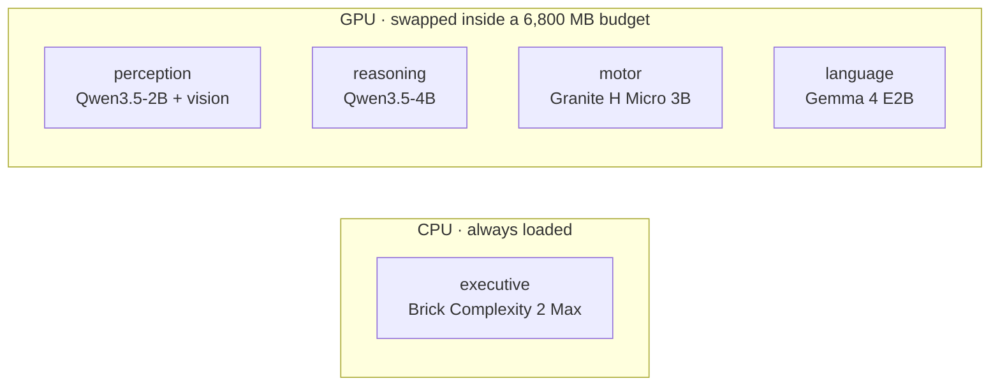

# Lobes

English | [中文](README.zh-CN.md)

Lobes is an experimental local AI runtime. It splits one assistant into several small models, and each one handles its own part of a request.

I started from a simple question. If an AI were a company, would it really need its most expensive all-rounder on every task? A math problem could go to someone good at math, an image to a vision model, and the arithmetic to a program. Lobes is me trying that on one consumer GPU.

The current version passes each request along five small models, each with one job. The default profile fits an RTX 4070 Laptop GPU with 8 GB VRAM by swapping GPU models in and out, while the executive classifier stays on the CPU.

[Scores](#benchmark-results) · [Architecture](#architecture) · [How it works](#how-it-works) · [Quick start](#quick-start) · [Conclusion](#conclusion) · [Guide](docs/GUIDE.en.md)

## Preview

Lobes solves with Qwen3.5-4B, so the main comparison is that same model alone, with the same tools on the same items. The gap between those two columns is what the other four lobes add. A standalone Qwen3.5-9B, about twice the size, is there for scale.

| 100 items per suite | bare Qwen3.5-4B | Lobes, medium | bare Qwen3.5-9B |
|---|---:|---:|---:|
| GSM8K | 66 | **71** | 69 |
| IFEval | 73 | **83** | 77 |
| MBPP+ | 66 | **79** | 77 |
| GPQA diamond | 67 | 69 | **71** |
| **400 together** | 272 | **302** | 294 |

Paired over all 400 items, Lobes is right where its own solver is wrong 60 times and wrong where it is right 30 times, a net 30 items at McNemar p = 0.002. It is also faster than that solver on three of the four suites. Against the 9B it's a tie, 43 against 35 at p = 0.428.

The gain is uneven. MBPP+ moves the most, +13 items at p = 0.004. There the bare 4B reads 1,037k prompt tokens against the relay's 562k, because it keeps every tool result in its own conversation and prefills it again each turn. GPQA barely moves, +2 items at p = 0.815. It mostly asks what a model already knows and calls a tool about twice an item, so there is little for a relay to split up.

All four are 100-item samples taken at an even stride through each published set, seed 0, the same items for every column, measured on an RTX 5090 with four requests in flight. Timings from that box are not what a single user sees; the 4070 numbers are below.

---

## Why this project exists

Small local models are cheap to run, but any one of them is unreliable across every kind of task. A larger model is more capable, but paying for the larger model on every request is wasteful when many requests are simple or can be checked by a program.

Lobes tries something in between:

- each lobe gets one job and decides for itself how to do it;
- the model that solves calls a program when there is something to compute;
- every request has a cap on tokens, model calls and time, and nothing escalates on its own;
- the models are only named in the config, and the runtime works the same with a different set.

It's an experiment, and I don't claim a modular system always beats a bigger model. The report keeps the ideas that failed and the runs that came out noisy, next to the ones that worked.

## Architecture

The default `specialists` profile uses a different model family for each lobe where that doesn't cost much.

| lobe | implementation | job |
|---|---|---|
| executive | Brick Complexity 2 Max, Q8, CPU resident | grade the request; a clear easy skips the review, everything else does not |
| perception | Qwen3.5-2B + vision projector | describe images and copy out their text |
| reasoning | Qwen3.5-4B | work the request out and write the reply; runs `python` itself |
| motor | Granite 4.0 H Micro 3B | the tool hand: runs the calls reasoning asks for, then answers from the results and keeps them |
| language | Gemma 4 E2B | read the finished draft against the request and say what is wrong with it |

The exact model mapping lives in [`lobes.yaml`](lobes.yaml).



More implementation detail is in [`docs/ARCHITECTURE.en.md`](docs/ARCHITECTURE.en.md).

## How it works

A request first reaches the executive. From there it takes one of a few paths, and only the models on that path run.


Each lobe is told what it is responsible for and what it hands on. Reasoning is the only lobe that answers the user; perception writes observations into its brief, motor carries out the tool calls it asks for in words, and language reads the finished draft. When language rejects a draft, the rejection goes into the trace and the draft still ships. It used to trigger a rewrite, and over three 250-item runs those rewrites rescued no answers and broke two.

A reply that runs out of room mid-sentence is asked for its conclusion alone, which gets appended to the draft. If the conclusion runs out of room too, it is dropped, because a reader takes the last block as the answer. A request that uses up its budget before there is any draft gets one more turn to answer from what it has already read and worked out.

`--effort low|medium|high` sets the thinking budget per call (1,024, 4,096 and 8,192 tokens) and the request's caps on generated tokens, model calls and seconds. The relay is the same at every level, and `auto`, `xhigh` and `max` are kept as aliases. The seconds limit stops new calls but does not interrupt a model load or a tool run, so a request can take longer. The exact policy is documented in [`docs/ARCHITECTURE.en.md`](docs/ARCHITECTURE.en.md).

## Benchmark results

Every column uses seed 0, the same 100 items per suite, and four requests in flight on an RTX 5090. The items are taken at an even stride through each published set, because the files group items by kind and the first 100 would all be one kind. Both baselines are the model as shipped, with the same eight tools Lobes has and no other lobe around it.


The scores are the table at the top of this page.

Paired against its own solver, suite by suite: MBPP+ +13 (p = 0.004), IFEval +10 (p = 0.087), GSM8K +5 (p = 0.424), GPQA +2 (p = 0.815). Only MBPP+ is significant on its own. The case rests on the 400 items together, where 60 go one way and 30 the other, p = 0.002.

Per-suite notes:

- On MBPP+ the bare 4B prefills 10,370 tokens an item against the relay's 5,620, because every tool result stays in its conversation and gets sent again on the next turn. In the relay the tool hand keeps the results and passes on a few sentences.
- The 9B prefills only 900 tokens an item on MBPP+. It mostly writes the answer directly and rarely reaches for tools, and still gets 77 there to the bare 4B's 66.
- Lobes is faster than its own solver on GSM8K, IFEval and MBPP+, and 3% slower on GPQA. On this box it is slower than the 9B on all four. With one request at a time on the 4070 that flips, see below.

### On the RTX 4070

This is the card the default profile targets, an RTX 4070 Laptop with 8 GB and a 6,800 MB budget. Everything below runs one request at a time, which is what a single user sees, on the same 400 items and seed 0 as the table at the top.

| Benchmark | bare 4B | Lobes | bare 9B |
|---|---:|---:|---:|
| GSM8K | 73 | **79** | 74 |
| IFEval | 76 | **81** | 71 |
| MBPP+ | 69 | **81** | 78 |
| GPQA diamond | 64 | 71 | **74** |
| **400 together** | 282 | **312** | 297 |

#### Seconds per item, median

| Benchmark | bare 4B | Lobes | bare 9B |
|---|---:|---:|---:|
| GSM8K | **9.7** | 13.8 | 13.6 |
| IFEval | **10.4** | 10.7 | 15.0 |
| MBPP+ | **10.6** | **10.6** | 11.0 |
| GPQA diamond | **75.4** | 77.7 | 119.8 |

#### Prompt tokens per item, median

| Benchmark | bare 4B | Lobes | bare 9B |
|---|---:|---:|---:|
| GSM8K | 2,040 | **1,542** | 2,016 |
| IFEval | 810 | 1,153 | **795** |
| MBPP+ | 3,574 | 2,186 | **824** |
| GPQA diamond | 8,242 | 5,604 | **4,708** |

Best per row in bold; lower is better in the last two tables. Paired over the 400, the relay is right where the bare 4B is wrong 60 times and wrong where it is right 30 times, p = 0.002, the same split the 5090 gives. Against the 9B it is 47 to 32, p = 0.115. MBPP+ is judged offline from the stored answers, because the in-run judge reads only a return code and cannot tell a failed test from a child that never started.

Only 19 of the relay's 400 requests had to load or unload a model, 65 s in total; the rest found every model already loaded. The 9B fits this card too, at 5,187 MB against the 6,800 MB budget, and stays loaded the whole time, so the comparison isn't about what fits in VRAM.

### How much to trust these numbers

Every column is a single run. On an earlier version, the same code run twice back to back on the same box scored 67 and 71 on 90 items, so a gap of a few items on one suite can be noise. The 400-item comparison with the bare 4B did repeat on a second machine: the 4070 gives the same 60-to-30 split as the 5090.

These suites are not held out. The 2,048-token conclusion budget was tuned on GPQA, and the 100 GPQA items here are a subset of the 198 it was tuned on. Dropping the review's rewrite was decided on the three 250-item runs mentioned above.

The `shared` profile, where one 4B vision model fills perception, reasoning and motor with the same prompts, has not been benchmarked yet. Until it is, I can't say how much of the gain comes from using different models and how much from giving each step its own prompt.

## Conclusion

Against the model inside it, the relay wins, and the 60-to-30 split held on both machines. This is the only comparison here against a control that uses the same solver.

Against the 9B it is ahead on the 4070 and level on the 5090. Neither gap is significant, so it keeps pace with a model twice its size.

The relay helps most on items where tools produce a lot of output, such as MBPP+, because the tool hand keeps the raw results out of the solver's conversation.

On the 4070 it is about three seconds an item slower than its own solver and a little faster than the 9B, most of all on long GPQA items.

The most useful result for me is still that the system improved when I took "AI" out of it. The verifier was a model and is now gone, the executive became a small CPU classifier, and the review model's rewrite went after it rescued nothing over three runs and broke two answers. Several preregistered ideas failed and were removed.

## Quick start

Requirements: NVIDIA GPU, Python 3.11+. Windows uses a llama.cpp release binary; Linux builds `llama-server` from source and needs git, cmake, and nvcc on `PATH`.

```bash
pip install -e .
lobes install
lobes serve
```

Then, in another terminal:

```bash
lobes ask "what is 17 * 23"
lobes ask --image shot.png "what is on this screen"
lobes api
```

`lobes api` serves `/v1/chat/completions`, `/v1/responses` and `/v1/models` on port 8090. The model name picks the profile: `lobes/specialists` is the default relay, and `lobes-v1` is the older one where a router hands each request to a single expert model. The thinking streams as `reasoning_content`, and when the request carries `tools`, the tool calls go back to the client to run. `lobes models` shows the current model state. `pip install -e .[dev,eval]` adds the test/evaluation dependencies; `.[ocr]` adds RapidOCR as the second image reader.

The step-by-step version, including how to connect Codex and DeepSeek Harness, is in [`docs/GUIDE.en.md`](docs/GUIDE.en.md).

> [!WARNING]
> Lobes can execute model-generated Python and shell commands. The runner is **not sandboxed**: only the file tools are confined to the run's work directory, and Python and shell have nothing but a 10-second timeout. Started as root it runs them as `nobody`, which keeps them out of your own files; that user still reaches the network and can read anything world-readable. Started as yourself they run with everything you have. Use a container or a disposable machine if you do not trust the workload.
>
> `lobes api` has no authentication. It listens on 127.0.0.1 and should stay there, because `--host 0.0.0.0` puts the python and shell tools in front of whoever can reach the port.

`lobes install` checks every model file against the `sha256` in `lobes.yaml` and deletes a download that does not match, so `HF_ENDPOINT` can point at a mirror without trusting it.

## Reproducing the experiment

The evaluation code is [`lobes/eval.py`](lobes/eval.py). The generated suites, the chart script and the setup for the rented 5090 are under [`eval/`](eval/).

```bash
pip install -e .[dev,eval]
pytest -q
lobes eval --help
```

GitHub Actions also runs the unit tests plus the standalone checks for the tool and evaluation modules on every push and pull request.

The preregistration notes, the round-by-round report and the per-item JSONL results are not in git. They will be attached to a GitHub release. With the JSONL files in `eval/results/<tag>/`, `lobes eval --report --tag <tag>` prints the score tables from them.

## Project status

Verified locally on an RTX 4070 Laptop GPU with 8 GB VRAM:

- model swapping stays inside the configured 6,800 MB GPU budget;
- the CPU classifier remains resident;
- local text and image requests work;
- the OpenAI-compatible API round-trips;
- OCR and screenshot paths reach the perception lobe;
- the test suite runs in CI.

Current limitations:

- no multi-turn memory;
- the 8 GB swap configuration handles one request at a time;
- concurrent evaluation requires enough VRAM to keep the needed models resident;
- SimpleQA-style factual recall remains weak;
- Python/shell execution is not sandboxed;
- generated source code is returned without being run or tested;
- no test runs against a live llama-server; every test replaces the model call;
- the `shared` profile has not been benchmarked, so there is no ablation of different models against different prompts.

## Repository map

- [`lobes/`](lobes/): runtime, model management, API, tools, and lobe implementations
- [`lobes.yaml`](lobes.yaml): model roster, providers, VRAM budget, and profiles
- [`eval/`](eval/): generated suites, the chart script, and the 5090 setup
- [`docs/GUIDE.en.md`](docs/GUIDE.en.md): step-by-step install and client setup
- [`docs/ARCHITECTURE.en.md`](docs/ARCHITECTURE.en.md): current design in English
- [`docs/ARCHITECTURE.md`](docs/ARCHITECTURE.md): current design in Chinese
- [`tests/`](tests/): unit tests

## License

MIT for the code in this repository.

The models have their own terms. `brick-2-max`, the classifier the default profile uses, is CC BY-NC 4.0, so the default profile as shipped is not free for commercial use; that slot is one line in `lobes.yaml`. `nemotron-3-nano-4b` in the `v1` profile is under the NVIDIA open model license. The other six are Apache 2.0.