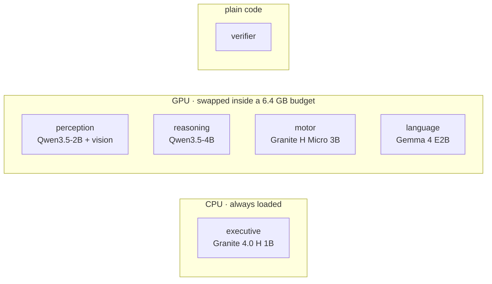
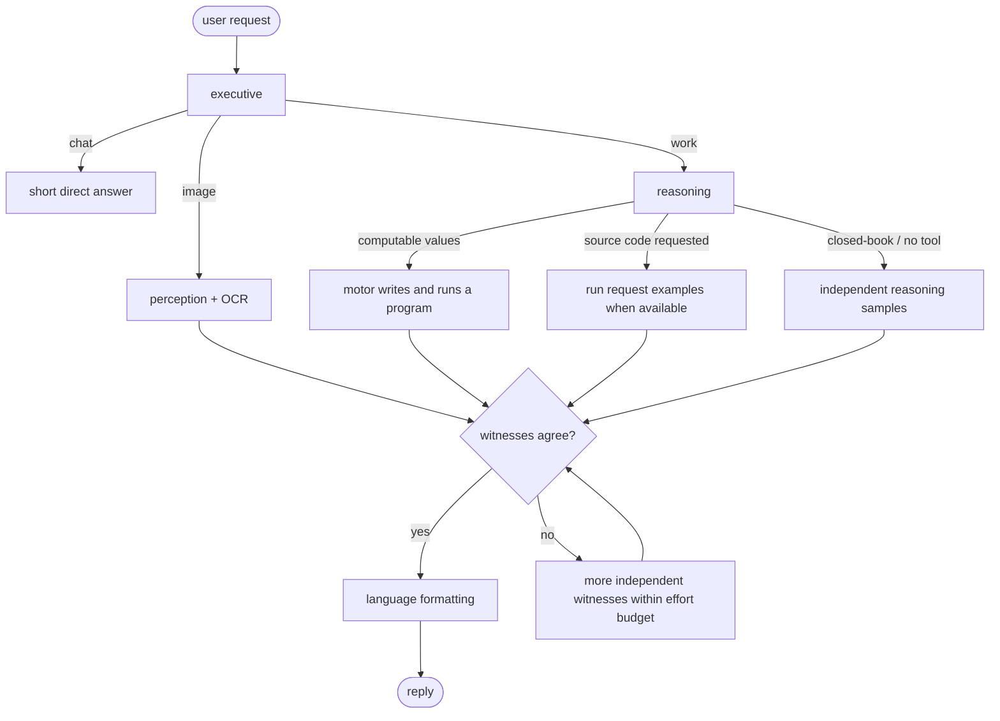
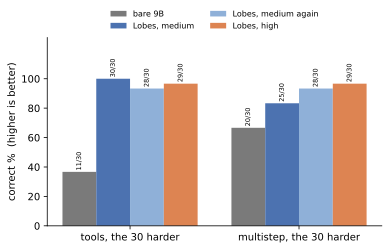

# Lobes

English | [中文](README.zh-CN.md)

**Lobes is an experimental local AI runtime that splits one assistant into small specialist models instead of asking one larger model to do everything.**

The idea is simple: a company does not need its most expensive generalist for every task. It can route a math problem to one worker, an image to another, let a program recompute the answer, and only spend more compute when the workers disagree. Lobes tests whether that idea is actually useful on a single consumer GPU.

The current system uses five small models plus a deterministic verifier. The default profile fits an RTX 4070 Laptop GPU with 8 GB VRAM by swapping GPU models in and out; the executive classifier stays on CPU.

## Result in one table

The main comparison is against a standalone Qwen3.5-9B with no scaffolding. On the 320 text items both systems can run, Lobes medium landed in the same score range across two repeated runs while using much less compute.

| | bare Qwen3.5-9B | Lobes, medium |
|---|---:|---:|
| correct / 320 | 268 | 272, 266 |
| tokens / item | 13,436 | **7,887** |
| seconds / item | 62 | **34** |
| image input | no | **yes** |

That is about **59% of the tokens** and **55% of the wall time** of the 9B baseline. The two Lobes runs also show why I do not claim an accuracy win: 268 sits between 272 and 266. The repeat changed the score but barely changed the cost.

On 60 harder compute-heavy items added later, Lobes scored 55 and 56 while the bare 9B scored 31. That result is useful, but it is not a clean model-vs-model comparison: Lobes has a Python tool and the bare baseline intentionally does not. I treat it as a result for the **whole runtime**, not evidence that the smaller models are individually smarter.

[Scores](#benchmark-results) · [Architecture](#architecture) · [How it works](#how-it-works) · [Quick start](#quick-start) · [Conclusion](#conclusion)

---

## Why this project exists

Small local models are cheap to run, but any one of them is unreliable across every kind of task. A larger model is more capable, but paying for the larger model on every request is wasteful when many requests are simple or can be checked by a program.

Lobes tries a middle ground:

- route each request to a specialist;
- keep independent witnesses from copying each other's mistakes;
- prefer values produced by a program over values only written by a model;
- spend extra samples only when the witnesses disagree;
- keep the model roster configurable instead of hardcoding one family into the runtime.

This is an experiment, not a claim that modular systems always beat larger models. The repository keeps the failed hypotheses and noisy runs because those were part of the result too.

## Architecture

The default `specialists` profile is intentionally heterogeneous where that does not cost much.

| lobe | implementation | job |
|---|---|---|
| executive | Granite 4.0 H 1B, Q8, CPU resident | classify the request and decide whether a program would help |
| perception | Qwen3.5-2B + vision projector | answer image questions and provide a visual reading |
| reasoning | Qwen3.5-4B | solve, reason, write implementations, and produce recomputation programs |
| motor | Granite 4.0 H Micro 3B | write a small program from the original request; its stdout becomes a witness |
| language | Gemma 4 E2B | turn settled values into a normal final answer without changing them |
| verifier | plain Python code | run examples, compare values, and check OCR/text evidence |

The exact model mapping lives in [`lobes.yaml`](lobes.yaml). The orchestration code does not hardcode model names, so the same runtime can be tested with different rosters.



## How it works

A request first reaches the executive. From there the system follows a small number of paths instead of running every model every time.



The important rule is that witnesses do not see each other's work. They receive the original request, plus image/OCR observations when needed. Two matching witnesses can settle a value. If a program ran successfully, model-written values cannot outvote its output. For requests with no computable evidence, the runtime requires repeated independent agreement instead.

`--effort low|medium|high|xhigh|max|auto` changes thinking budgets, witness counts, repair attempts, and request caps. `auto` starts at medium and only climbs when the current budget is exhausted. The exact policy is documented in [`docs/ARCHITECTURE.md`](docs/ARCHITECTURE.md).

## Benchmark results

All rows below use seed 0, the same items within a comparison, and four requests in flight on the evaluation box. The standalone baseline is Qwen3.5-9B as shipped: one model call per item, no Lobes orchestration, no Python tool, and no image input.

The medium profile was run twice on the same code and machine. Both scores are shown instead of selecting the better run.


| suite | bare 9B | Lobes medium (two runs) | Lobes high | tokens / item, 9B | medium | high | seconds / item, 9B | medium | high |
|---|---:|---:|---:|---:|---:|---:|---:|---:|---:|
| GSM8K, 200 | 184 | 182, 181 | 181 | 10,924 | 5,308 | 7,869 | 51 | 24 | 38 |
| HumanEval, 30 | 29 | 29, 27 | 28 | 15,786 | 6,516 | 8,532 | 76 | 28 | 46 |
| tools, 30 | 25 | 30, 30 | 30 | 15,176 | 8,134 | 19,867 | 72 | 35 | 95 |
| multistep, 30 | 25 | 27, 25 | 26 | 19,182 | 14,248 | 24,791 | 88 | 61 | 123 |
| SimpleQA, 30 | 5 | 4, 3 | 2 | 20,349 | 19,841 | 45,388 | 86 | 81 | 226 |
| OCRBench, 50 | — | 36, 37 | 36 | — | 11,109 | 15,857 | — | 54 | 70 |
| **shared 320 text items** | **268** | **272, 266** | **267** | **13,436** | **7,887** | **14,160** | **62** | **34** | **70** |

A few things matter more than the headline score:

- **Tools was stable:** Lobes medium scored 30/30 in both runs versus 25/30 for the bare 9B.
- **SimpleQA stayed weak:** all of these local models are poor closed-book factual systems here. Lobes mostly learned to abstain rather than confidently guess.
- **High effort was not worth it:** 267/320 sits inside the medium spread while using about 80% more tokens than medium.
- **The repeated medium runs were not identical:** 11 of 370 items changed verdict. With four concurrent llama-server slots, different batch composition changes floating-point reductions even with the same seed. Cost was much more stable than accuracy: the two runs differed by about 1% in tokens and time.

### Harder compute set

The original tools suite hit 30/30, so I added 30 harder tools items and 30 harder multistep items. The old items were left unchanged. Expected values for the added items are generated in `eval/suites/make.py` rather than typed into the benchmark by hand.



| 30 added items per suite | bare 9B | Lobes medium (two runs) | Lobes high | tokens / item, 9B | medium | high | seconds / item, 9B | medium | high |
|---|---:|---:|---:|---:|---:|---:|---:|---:|---:|
| tools, harder 30 | 11 | 30, 28 | 29 | 6,662 | 12,776 | 27,368 | 54 | 51 | 121 |
| multistep, harder 30 | 20 | 25, 28 | 29 | 5,260 | 16,425 | 35,747 | 41 | 68 | 162 |
| **60 together** | **31** | **55, 56** | **58** | **5,961** | **14,601** | **31,558** | **48** | **60** | **141** |

The harder set changes the tradeoff. Lobes gains a lot of score, but medium uses about 2.5× the tokens of the bare 9B over these 60 items because several witnesses and programs are needed. Calls overlap, so wall time grows much less than token count.

**Important:** the bare 9B has no external tools. The tools comparison therefore measures the full Lobes runtime, not just model quality. A cleaner ablation would give the 9B the same Python access; that experiment is still missing.

Full per-suite analysis, deviations, witness statistics, and the preregistered hypotheses are in [`eval/REPORT.md`](eval/REPORT.md). The rules for each round were written before running it: [`eval/PREREG.md`](eval/PREREG.md), [`eval/PREREG-v3.md`](eval/PREREG-v3.md), and [`eval/PREREG-v4.md`](eval/PREREG-v4.md).

## Conclusion

The experiment supports a narrower conclusion than I expected when I started it.

On the normal 320-item text set, **Lobes did not clearly beat the standalone 9B on accuracy**. Its repeated medium runs landed on both sides of the 9B score. What did hold up was efficiency: medium used roughly 41% fewer tokens and 45% less wall time while staying in the same score range.

On compute-heavy tasks, the modular design was much stronger because independent programs can catch mistakes that another language-model sample often repeats. But that advantage comes with extra token cost, and part of it comes from having a Python interpreter at all.

The most useful result for me is that the system became better when I removed some "AI" from it. The verifier used to be another model; now it is mostly deterministic code. The executive became a small CPU classifier. High effort looked attractive but did not pay for itself. Several preregistered ideas failed and were removed.

So the current takeaway is:

> Small specialist models can be a practical alternative to running one larger model for every request, especially when the task can be checked with tools. The main benefit in this version is **compute efficiency and verifiability**, not a universal accuracy win.

## Quick start

Requirements: NVIDIA GPU, Python 3.11+. Windows uses a llama.cpp release binary; Linux builds `llama-server` from source and needs git, cmake, and nvcc on `PATH`.

```bash
pip install -e .
lobes install
lobes serve
```

Then, in another terminal:

```bash
lobes ask "what is 17 * 23"
lobes ask --image shot.png "what is on this screen"
lobes api
```

`lobes api` exposes an OpenAI-compatible `/v1/chat/completions` endpoint on port 8090. `lobes models` shows the current model state. `pip install -e .[dev,eval]` adds the test/evaluation dependencies; `.[ocr]` adds RapidOCR as the second image reader.

> [!WARNING]
> Lobes can execute model-generated Python and shell commands. The current runner is intentionally **not sandboxed**. Python and shell run with the permissions of the current user. Use a container or disposable environment if you do not trust the workload.

File tools are restricted to the run work directory, but Python and shell are not. Tool execution has a 10-second timeout.

## Reproducing the experiment

The evaluation harness is included in the repository rather than being a separate notebook. The benchmark code, preregistration notes, and report are under `eval/`.

```bash
pip install -e .[dev,eval]
pytest -q
lobes eval --help
```

GitHub Actions also runs the unit tests plus the standalone checks for the tool, verifier, and evaluation modules on every push and pull request.

The repository intentionally does not keep every large per-item trace in git. Release artifacts can contain the full JSONL results when needed.

## Project status

This is still an experimental project.

Verified locally on an RTX 4070 Laptop GPU with 8 GB VRAM:

- model swapping stays inside the configured 6.4 GB GPU budget;
- the CPU classifier remains resident;
- local text and image requests work;
- the OpenAI-compatible API round-trips;
- OCR and screenshot paths reach the perception lobe;
- the test suite runs in CI.

Current limitations:

- no multi-turn memory;
- the 8 GB swap configuration handles one request at a time;
- concurrent evaluation requires enough VRAM to keep the needed models resident;
- SimpleQA-style factual recall remains weak;
- Python/shell execution is not sandboxed;
- the 9B tool-access ablation is still missing.

## Repository map

- [`lobes/`](lobes/) — runtime, model management, API, tools, and lobe implementations
- [`lobes.yaml`](lobes.yaml) — model roster, providers, VRAM budget, and profiles
- [`eval/`](eval/) — suites, preregistration, evaluation harness, and report
- [`docs/ARCHITECTURE.md`](docs/ARCHITECTURE.md) — current design
- [`docs/DECISIONS.md`](docs/DECISIONS.md) — dated engineering decisions and failed ideas
- [`tests/`](tests/) — unit tests

MIT License.
