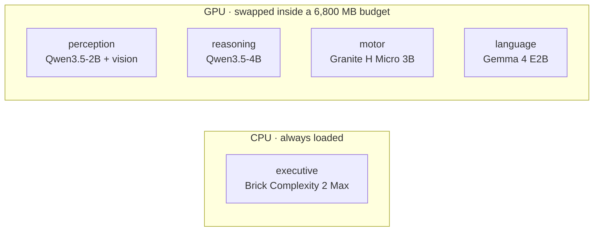
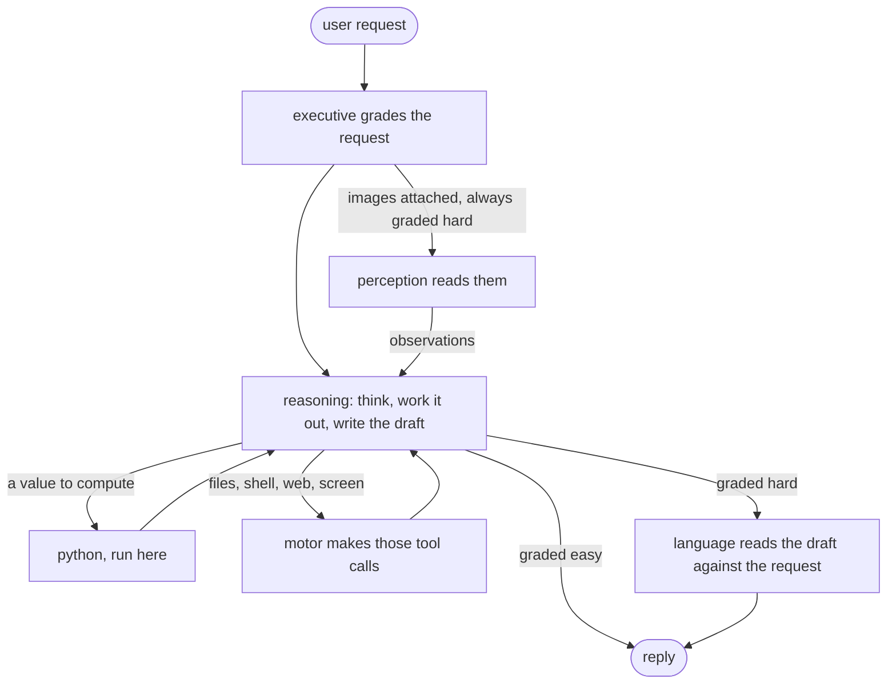

# Lobes

English | [中文](README.zh-CN.md)

Lobes is an experimental local AI runtime. It splits one assistant into small specialist models and sends each request to the one that fits it.

A company does not need its most expensive generalist for every task. It can route a math problem to one worker, an image to another, and let a program do the arithmetic. Lobes tests whether that idea is actually useful on a single consumer GPU.

The current system relays a request through five small models with one job each. The default profile fits an RTX 4070 Laptop GPU with 8 GB VRAM by swapping GPU models in and out; the executive classifier stays on CPU.

[Scores](#benchmark-results) · [Architecture](#architecture) · [How it works](#how-it-works) · [Quick start](#quick-start) · [Conclusion](#conclusion)

## Preview

Lobes solves with Qwen3.5-4B, so the comparison that matters is against that same model alone, given the same tools and the same items. Whatever separates those two columns is what the other four lobes are worth. A standalone Qwen3.5-9B, about twice the size, is there for scale.

| 100 items per suite | bare Qwen3.5-4B | Lobes, medium | bare Qwen3.5-9B |
|---|---:|---:|---:|
| GSM8K | 66 | **71** | 69 |
| IFEval | 73 | **83** | 77 |
| MBPP+ | 66 | **79** | 77 |
| GPQA diamond | 67 | 69 | **71** |
| **400 together** | 272 | **302** | 294 |

Paired over all 400 items, Lobes is right where its own solver is wrong 60 times and wrong where it is right 30 times, a net 30 items at McNemar p = 0.002. It is also faster than that solver on three of the four suites. Against the 9B the score is a tie, 43 against 35 at p = 0.428: a 4B relay lands level with a model twice its size.

The gain is uneven across the four. MBPP+ is the clearest case: +13 items, p = 0.004, and there the bare 4B reads 1,037k prompt tokens against the relay's 562k because it carries every tool result in its own conversation and prefills it again each turn. GPQA is the flat one: +2 items, p = 0.815. It rewards recall, calls a tool about twice an item, and leaves a relay almost nothing to divide up.

All four are 100-item samples taken at an even stride through each published set, seed 0, the same items for every column, measured on an RTX 5090 with four requests in flight. Timings from that box are not what a single user sees; the 4070 numbers are below.

---

## Why this project exists

Small local models are cheap to run, but any one of them is unreliable across every kind of task. A larger model is more capable, but paying for the larger model on every request is wasteful when many requests are simple or can be checked by a program.

Lobes tries a middle ground:

- give each lobe one job and let it decide how to do it;
- let the model that solves call a program instead of computing in its head;
- cap the tokens, model calls and time of every request, with no automatic escalation;
- keep the model roster configurable, with no model family hardcoded into the runtime.

This is an experiment. I make no claim that modular systems always beat larger models. The repository keeps the failed hypotheses and noisy runs because those were part of the result too.

## Architecture

The default `specialists` profile mixes model families on purpose, where that does not cost much.

| lobe | implementation | job |
|---|---|---|
| executive | Brick Complexity 2 Max, Q8, CPU resident | grade the request; a clear easy skips the review, everything else does not |
| perception | Qwen3.5-2B + vision projector | describe images and copy out their text |
| reasoning | Qwen3.5-4B | work the request out and write the reply; runs `python` itself |
| motor | Granite 4.0 H Micro 3B | the tool hand: runs the calls reasoning asks for, then answers from the results and keeps them |
| language | Gemma 4 E2B | read the finished draft against the request and say what is wrong with it |

The exact model mapping lives in [`lobes.yaml`](lobes.yaml). The orchestration code does not hardcode model names, so the same runtime can be tested with different rosters.



More implementation detail is in [`docs/ARCHITECTURE.en.md`](docs/ARCHITECTURE.en.md).

## How it works

A request first reaches the executive. From there it follows one of a small number of paths; the system does not run every model every time.



Each lobe is told what it is responsible for and what it hands on, and decides for itself how to do it. Reasoning is the only lobe that answers the user; perception writes observations into its brief, motor carries out the tool calls it asks for in words, and language reads the finished draft. A rejection from language is written into the trace and the draft still ships: over three 250-item runs the rewrite it used to trigger rescued no answers and broke two.

A reply that runs out of room mid-sentence is asked for its conclusion alone, and that is appended to the draft. A conclusion that runs out of room in its turn is dropped, because a reader takes the last block for the answer. A request that spends its whole budget without producing a draft gets one more turn to answer from the conversation it already has, so that what it read and worked out reaches the reader instead of a line saying it could not finish.

`--effort low|medium|high` sets the thinking budget per call (1,024, 4,096 and 8,192 tokens) and the request's caps on generated tokens, model calls and seconds. The relay is the same at every level and nothing escalates on its own; `auto`, `xhigh` and `max` are kept as aliases. The seconds limit stops new calls but does not interrupt a model load or a tool run, so a request can take longer. The exact policy is documented in [`docs/ARCHITECTURE.en.md`](docs/ARCHITECTURE.en.md).

## Benchmark results

Every column uses seed 0, the same 100 items per suite, and four requests in flight on an RTX 5090. The items are taken at an even stride through each published set, because the files group items by kind and the first 100 would all be one kind. Both baselines are the model as shipped, with the same eight tools Lobes has and no other lobe around it.


| Benchmark | bare 4B | Lobes | bare 9B |
|---|---:|---:|---:|
| GSM8K | 66 | **71** | 69 |
| IFEval | 73 | **83** | 77 |
| MBPP+ | 66 | **79** | 77 |
| GPQA diamond | 67 | 69 | **71** |
| **400 together** | 272 | **302** | 294 |

Best per row in bold. Seconds and tokens per item are in the second chart above.

Paired against its own solver, suite by suite: MBPP+ +13 (p = 0.004), IFEval +10 (p = 0.087), GSM8K +5 (p = 0.424), GPQA +2 (p = 0.815). Only MBPP+ clears significance alone. The case rests on the 400 items together, where 60 go one way and 30 the other, p = 0.002.

Per-suite notes:

- MBPP+ shows the split most plainly. The bare 4B prefills 10,370 tokens an item against the relay's 5,620: every tool result stays in its conversation and is sent again on the next turn. The relay's tool hand keeps the results and hands over a few sentences.
- GPQA is the flat suite, and it should be. It asks what a model already knows and calls a tool about twice an item, which leaves a relay nothing to divide up.
- The 9B prefills 900 tokens an item on MBPP+ against the 4B's 10,370, because it mostly writes the answer instead of reaching for tools. That is how it reaches 77 there while the bare 4B gets 66.
- Lobes is faster than its own solver on GSM8K, IFEval and MBPP+, and 3% slower on GPQA. It is slower than the 9B on all four here. With one request at a time on the 4070 that reverses; see below.

### On the RTX 4070

This is the card the default profile targets. Everything below runs one request at a time, which is what a single user sees.

**Environment.** RTX 4070 Laptop, 8 GB, 6,800 MB budget. One request in flight. Seed 0, the same 400 items as the table above.

| Benchmark | bare 4B | Lobes | bare 9B |
|---|---:|---:|---:|
| GSM8K | 73 | **79** | 74 |
| IFEval | 76 | **81** | 71 |
| MBPP+ | 69 | **81** | 78 |
| GPQA diamond | 64 | 71 | **74** |
| **400 together** | 282 | **312** | 297 |

#### Seconds per item, median

| Benchmark | bare 4B | Lobes | bare 9B |
|---|---:|---:|---:|
| GSM8K | **9.7** | 13.8 | 13.6 |
| IFEval | **10.4** | 10.7 | 15.0 |
| MBPP+ | **10.6** | **10.6** | 11.0 |
| GPQA diamond | **75.4** | 77.7 | 119.8 |

#### Prompt tokens per item, median

| Benchmark | bare 4B | Lobes | bare 9B |
|---|---:|---:|---:|
| GSM8K | 2,040 | **1,542** | 2,016 |
| IFEval | 810 | 1,153 | **795** |
| MBPP+ | 3,574 | 2,186 | **824** |
| GPQA diamond | 8,242 | 5,604 | **4,708** |

Best per row in bold; lower is better in the last two tables. Paired over the 400, the relay is right where the bare 4B is wrong 60 times and wrong where it is right 30 times, p = 0.002, the same split the 5090 gives. Against the 9B it is 47 to 32, p = 0.115. MBPP+ is judged offline from the stored answers, because the in-run judge reads only a return code and cannot tell a failed test from a child that never started.

Loading a model in or out happened on 19 of the relay's 400 requests and cost 65 s in total; the rest found every model already resident. The 9B fits this card too: 5,187 MB against a 6,800 MB budget, resident, with no swapping. None of the above is a memory argument.

## Conclusion

The relay earns its keep against the model inside it. Over 400 paired items on the 5090 it is right where the bare 4B is wrong 60 times and wrong where it is right 30 times, p = 0.002. The 4070 run, on different hardware with one request at a time, lands on the same split: 60 and 30, p = 0.002. That is the claim this repository is for, and it is the only one here measured against a control that shares a solver.

It also outscores the 9B. On the 4070 the three arms finish at 312, 297 and 282 out of 400, so a relay whose largest model is that same 4B comes out ahead of one more than twice its size. Paired that is 47 items to 32, p = 0.115: ahead, short of significance. On the 5090 the two tie, 302 against 294.

The second model pays for itself where tool output piles up. MBPP+ hands back a lot of it, and on the 4070 the relay scores 81 there against the bare 4B's 69 while reading 2,186 prompt tokens an item against 3,574, because the tool hand keeps the results and passes on a few sentences instead of resending the whole conversation. GPQA is the flat suite and should be: it asks what a model already knows and calls a tool about twice an item, which leaves a relay nothing to divide up.

One request at a time on the 4070, a typical item takes 15.0 s on the relay against the 9B's 16.8 s, and the gap opens where the work is long: 77.7 s against 119.8 s on GPQA. The bare 4B on its own is quicker at 12.0 s, which is what the extra hands cost.

The most useful result for me is still that the system improved when I took "AI" out of it. The verifier was a model and is now gone, the executive became a small CPU classifier, and the review model's rewrite went after it rescued nothing over three runs and broke two answers. Several preregistered ideas failed and were removed.

## Quick start

Requirements: NVIDIA GPU, Python 3.11+. Windows uses a llama.cpp release binary; Linux builds `llama-server` from source and needs git, cmake, and nvcc on `PATH`.

```bash
pip install -e .
lobes install
lobes serve
```

Then, in another terminal:

```bash
lobes ask "what is 17 * 23"
lobes ask --image shot.png "what is on this screen"
lobes api
```

`lobes api` serves `/v1/chat/completions`, `/v1/responses` and `/v1/models` on port 8090. The model name picks the profile: `lobes/specialists` is the default relay, and `lobes-v1` is the older one where a router hands each request to a single expert model. The thinking streams as `reasoning_content`, and when the request carries `tools`, the tool calls go back to the client to run. `lobes models` shows the current model state. `pip install -e .[dev,eval]` adds the test/evaluation dependencies; `.[ocr]` adds RapidOCR as the second image reader.

> [!WARNING]
> Lobes can execute model-generated Python and shell commands. The runner is **not sandboxed**. Started as root it runs them as `nobody`, which keeps them out of your own files; that user still reaches the network and can read anything world-readable. Started as yourself they run with everything you have. Use a container or a disposable machine if you do not trust the workload.
>
> `lobes api` has no authentication. It listens on 127.0.0.1 and should stay there, because `--host 0.0.0.0` puts the python and shell tools in front of whoever can reach the port.

File tools are restricted to the run work directory, but Python and shell are not. Tool execution has a 10-second timeout.

`lobes install` checks every model file against the `sha256` in `lobes.yaml` and deletes a download that does not match, so `HF_ENDPOINT` can point at a mirror without trusting it.

## Reproducing the experiment

The benchmark code, preregistration notes, and report are under `eval/`.

```bash
pip install -e .[dev,eval]
pytest -q
lobes eval --help
```

GitHub Actions also runs the unit tests plus the standalone checks for the tool and evaluation modules on every push and pull request.

The repository intentionally does not keep every large per-item trace in git. Release artifacts can contain the full JSONL results when needed.

## Project status

Verified locally on an RTX 4070 Laptop GPU with 8 GB VRAM:

- model swapping stays inside the configured 6,800 MB GPU budget;
- the CPU classifier remains resident;
- local text and image requests work;
- the OpenAI-compatible API round-trips;
- OCR and screenshot paths reach the perception lobe;
- the test suite runs in CI.

Current limitations:

- no multi-turn memory;
- the 8 GB swap configuration handles one request at a time;
- concurrent evaluation requires enough VRAM to keep the needed models resident;
- SimpleQA-style factual recall remains weak;
- Python/shell execution is not sandboxed;
- generated source code is returned without being run or tested;
- no test runs against a live llama-server; every test replaces the model call.

## Repository map

- [`lobes/`](lobes/): runtime, model management, API, tools, and lobe implementations
- [`lobes.yaml`](lobes.yaml): model roster, providers, VRAM budget, and profiles
- [`eval/`](eval/): suites, preregistration, evaluation harness, and report
- [`docs/ARCHITECTURE.en.md`](docs/ARCHITECTURE.en.md): current design in English
- [`docs/ARCHITECTURE.md`](docs/ARCHITECTURE.md): current design in Chinese
- [`tests/`](tests/): unit tests

## A longer walkthrough

The quick start above is three commands. This section takes them apart, which is what you want the first time through.

### Before you install

You need an NVIDIA card and Python 3.11 or newer. 8 GB of VRAM runs the default `specialists` profile. Below that you have to lower `llama.vram_budget_mb` in `lobes.yaml` and the `vram_mb` on each model yourself.

Windows downloads a prebuilt llama.cpp, so you need no compiler. Linux builds `llama-server` from source, so `git`, `cmake` and `nvcc` have to be on `PATH`. Miss one and the first step stops there.

### Install

```bash
pip install -e .
lobes install
```

`lobes install` fetches llama.cpp and the models the current profile uses, then writes `models/models.ini`. The models come to several GB, so the first run takes a while. If it dies partway, run it again; whatever finished downloading is not fetched twice.

To fetch one profile's models only:

```bash
lobes install --profile specialists
```

Add `--skip-llama` if you put llama.cpp in place yourself.

### Start the server

```bash
lobes serve
```

This holds the terminal, so leave it open. It starts llama.cpp's router on port 8080 with no model loaded, waiting to load and unload on demand. Every `lobes serve` rewrites `models/models.ini`, so a change to the models in `lobes.yaml` takes effect on a restart.

### Ask it something

In a second terminal:

```bash
lobes ask "write me a snake game in python"
```

The first request is slow because the model has to go into VRAM before it can start. While the model stays loaded, the next one begins answering right away.

With an image:

```bash
lobes ask --image shot.png "what is on this screen"
```

To let it think longer:

```bash
lobes ask --effort high "sort this CSV by the third column and average each group"
```

`--effort` takes low, medium or high and defaults to medium. A level sets how long reasoning may think per call and the caps on the whole request. The shape of the relay stays the same.

To see what is in VRAM right now:

```bash
lobes models
```

### Optional extras

```bash
pip install -e ".[ocr]"        # adds RapidOCR as a second reader for text in images
pip install -e ".[dev,eval]"   # what the tests and the benchmark need
```

### Connect Codex

Start the API first:

```bash
lobes api
```

It opens three endpoints on port 8090: `/v1/chat/completions`, `/v1/responses` and `/v1/models`. Codex uses `/v1/responses`.

Then write `~/.codex/config.toml`:

```toml
model = "lobes/specialists"
model_provider = "lobes"
model_reasoning_effort = "medium"

[model_providers.lobes]
name = "Lobes"
base_url = "http://127.0.0.1:8090/v1"
wire_api = "responses"
```

Stop `base_url` at `/v1`. Codex appends `/responses` itself, and spelling it out gives you a 404.

`model` holds a profile, written `lobes/<profile>`. `lobes.yaml` currently has `specialists` (the default), `shared`, `v1`, `bare-9b`, `bare-4b`, `single-9b` and `single-4b`. `lobes-v1` is an alias for `v1`.

`model_reasoning_effort` reaches the levels above, with `auto`, `xhigh` and `max` read as medium, high and high. Codex sometimes sends `minimal`, which Lobes does not recognise, so the default in `lobes.yaml` applies.

There is no `env_key` here because `api.py` and `responses.py` hold no auth code and never look at a key. Put any string there if your client insists on one.

On the turns where Codex brings its own tools, the tool calls go back to Codex to run.

### Connect DeepSeek Harness

The harness speaks chat completions, so the same port 8090 covers it.

Add this to `$DSH_HOME/settings.yaml`:

```yaml
llm-pi-ai:
  providers:
    lobes:
      api: openai-completions
      baseURL: http://127.0.0.1:8090/v1
      models:
        - id: lobes/specialists
```

The provider then shows up in the model picker, and picking a model once makes it the default for new sessions.

Every turn, the harness sends its workspace and policy snapshot as a user message. Lobes recognises it through the `CONTEXT` constant in `api.py` and folds the latest one into the system prompt instead of answering it as a new request.

### When it gets stuck

Without `lobes serve` running, `lobes ask` cannot reach port 8080.

When VRAM runs out the model manager raises instead of quietly going over budget. Lower `vram_budget_mb`, or give a model `resident: true` so it never gets unloaded.

Every request writes its whole run to `runs/<task_id>/trace.jsonl`, one line per step, with each tool's raw output stored as its own json. Read that file first when an answer comes out wrong.

## License

MIT for the code in this repository.

The models have their own terms. `brick-2-max`, the classifier the default profile uses, is CC BY-NC 4.0, so the default profile as shipped is not free for commercial use; that slot is one line in `lobes.yaml`. `nemotron-3-nano-4b` in the `v1` profile is under the NVIDIA open model license. The other six are Apache 2.0.