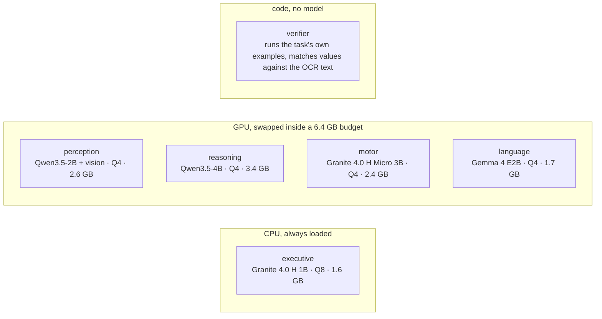

# Lobes

English | [中文](README.zh-CN.md)

Six lobes on an 8 GB laptop GPU, five small models and one checker that is plain code,
one job each. An answer counts when two of them reach it without seeing each other's
work, and what a program printed beats what a model wrote. The eval asks one question:
does that buy anything over one 9B model with no scaffolding at all? On the 320 items
both can run it scores the same, on 59% of that 9B's tokens and 55% of its seconds. On 60
harder items added afterwards, where the answer has to be computed rather than recalled, it
scores 55 and 56 against that 9B's 31 — and there it is the expensive one, at 2.5x the tokens.

[Scores](#scores) · [The harder half](#the-harder-half) · [Models](#models) ·
[How it works](#how-it-works) · [Quick start](#quick-start) · [Status](#status)

## Scores

One RTX 5090, seed 0, the same items for every line, four items in flight on each box. Bare 9B
is Qwen3.5-9B as shipped, one call per item, no tools, no images. Lobes is this runtime with the
`specialists` profile, at medium and at high; medium ran twice on the same code and box and both
are in the table, the token and second columns from the first, within 1% of the second.

| suite | bare 9B | Lobes, medium (two runs) | Lobes, high | tokens per item, 9B | medium | high | seconds per item, 9B | medium | high |
|---|---|---|---|---|---|---|---|---|---|
| GSM8K, 200 | 184 | 182, 181 | 181 | 10,924 | 5,308 | 7,869 | 51 | 24 | 38 |
| HumanEval, 30 | 29 | 29, 27 | 28 | 15,786 | 6,516 | 8,532 | 76 | 28 | 46 |
| tools, 30 | 25 | 30, 30 | 30 | 15,176 | 8,134 | 19,867 | 72 | 35 | 95 |
| multistep, 30 | 25 | 27, 25 | 26 | 19,182 | 14,248 | 24,791 | 88 | 61 | 123 |
| SimpleQA, 30 | 5 | 4, 3 | 2 | 20,349 | 19,841 | 45,388 | 86 | 81 | 226 |
| OCRBench, 50 | no images | 36, 37 | 36 | | 11,109 | 15,857 | | 54 | 70 |
| the 320 the 9B runs | 268 | 272, 266 | 267 | 13,436 | 7,887 | 14,160 | 62 | 34 | 70 |

The point of the split was the same answers for fewer tokens and less time, from models an
8 GB laptop GPU can hold. That is what it got, and no more. On score the two medium runs
(272, 266) and high (267) all sit around the 9B's 268; on cost they do not — 7,887 tokens
and 34 seconds an item against 13,436 and 62 — and it answers the 50 image items the 9B
cannot take at all.

Two results clear that spread. Tools is 30/30 in both runs against 25/30, the only suite
where no item changed verdict. SimpleQA is a hedge test: the 9B answers all 30 and is wrong
on 25, while this runtime abstains on 25 and 24 and is wrong on 4 and 5. Everything else is
noise, GSM8K's 182 and 181 against 184 included; high sits inside the medium spread for 80%
more tokens, because nothing here needs more than medium's 6000-token thinking budget. The
spread is real: 11 of the 370 items came out differently between the two medium runs and
only 224 ended on the same answer string, because llama-server runs four items at once and
batch composition changes the floating-point reductions.

## The harder half

Two of the suites above were at a ceiling: 30/30 on tools in every run for two versions
measures nothing. So 30 harder items were written for each, the old 30 left untouched so the
numbers above still stand, every expected value computed in `eval/suites/make.py` and none
typed in. The new tools items need a computation long enough that no model this size reaches
it by writing; the new multistep items are 4 to 6 step chains asking for three values each.
Same box, same seed, same four workers, medium run twice.

| the 30 added to each suite | bare 9B | Lobes, medium (two runs) | Lobes, high | tokens per item, 9B | medium | high | seconds per item, 9B | medium | high |
|---|---|---|---|---|---|---|---|---|---|
| tools, 30 harder | 11 | 30, 28 | 29 | 6,662 | 12,776 | 27,368 | 54 | 51 | 121 |
| multistep, 30 harder | 20 | 25, 28 | 29 | 5,260 | 16,425 | 35,747 | 41 | 68 | 162 |
| the 60 together | 31 | 55, 56 | 58 | 5,961 | 14,601 | 31,558 | 48 | 60 | 141 |

The two medium runs are 4 items apart here, the same noise as before, so tools at 30 and 28
against 11 clears it easily and multistep at 25 and 28 against 20 clears it but not by much.
What the tools gap is not: both suites reward running a program and the bare 9B has no tools,
so part of those 19 points is the architecture and part is having a python interpreter. This
eval does not separate them, and the comparison is deliberately against the 9B as you would
actually run it rather than against an ablation of this runtime.

The cost claim at the top of this page does not carry onto these items and is not meant to.
Where one sample gets the answer, splitting the work saves the 9B's long think; where it does
not, this runtime pays for several witnesses and a program each — 2.5x the tokens over the 60,
though only 1.25x the seconds, because its calls overlap where the 9B's thinking is one serial
stream. High again is not worth it: 58 against a medium band of 55 to 56, for 2.2x the tokens.

Per-item reading, witness statistics and the pre-registered hypotheses (four of eight failed in
v3, three of seven in v4) are in [eval/REPORT.md](eval/REPORT.md). The rules were written down
before each round ran: [PREREG](eval/PREREG.md), [v3](eval/PREREG-v3.md), [v4](eval/PREREG-v4.md).

## Models

One family per lobe where it does not hurt. The roster is `lobes.yaml` and nothing in the code
names a model; a lobe can also be plain code. Everything runs on this machine, nothing is sent
anywhere, and no bigger model is called when a request looks hard. On the 4070 the GPU models
swap in and out of a 6.4 GB budget; the classifier sits on the CPU and never swaps.

## How it works

Each witness gets the user's request (and, for images, what perception and the OCR engine
read, labelled) and nothing another witness produced. A value is one line per thing the
request asks for, in that order, and two witnesses agree when every line matches — one that
printed intermediates first only has to match on its tail. Two that agree settle it:
`evidence` when one of them ran a program, `consistency` when neither did. Once any program
has run, values models wrote cannot outvote it; a request with nothing to compute needs
three samples in a row to agree.

Three of those rules were bought with items. The reasoning lobe thinks and motor answers plain,
because a version where both answered plain lost ten GSM8K items, nine of them because the two
misread the same clause and agreed on the same wrong number. With an image only perception saw
it, so a settling pair must include perception, and it thinks on the image as the effort says —
the 2B read 35 of 50 with thinking on and 32 without. The verifier is code and does not vote. A
witness's program that dies gets one repair with its own stderr; only the code path rewrites again.
`--effort low|medium|high|xhigh|max|auto` scales thinking, witness count, rewrites and the
per-request caps; the table is in [docs/ARCHITECTURE.md](docs/ARCHITECTURE.md).

## Quick start

NVIDIA GPU, Python 3.11+. Windows gets the llama.cpp release binary; Linux builds
llama-server from source (git, cmake, nvcc on PATH).

    pip install -e .
    lobes install                   # llama.cpp + the GGUFs for the default profile
    lobes serve                     # keep this running
    lobes ask "what is 17 * 23"
    lobes ask --image shot.png "what is on this screen"
    lobes api                       # OpenAI-compatible /v1/chat/completions on :8090

`lobes models` shows what is loaded. `pip install -e .[dev,eval]` adds pytest and the
suite readers for `lobes eval`; `.[ocr]` adds the second image reader.

**What this runs on your machine.** The motor lobe answers anything computable by picking a tool
and running it: a python subprocess, a shell command, a file read or write inside the run's work
dir, a url fetch, a screenshot. Python and shell execute whatever the model wrote, as you, with a
10 second timeout and nothing else in the way — there is no sandbox, and that is the design: a
program ran and printed the answer. The file tools are confined to the work dir, those two are not.
On a machine you would not hand to a 3B model, put the whole process in a container.

## Status

Verified on an RTX 4070 Laptop (8 GB): the models load and answer under grammar constraints,
the swap chain stays inside the budget, the api round-trips, screenshots reach the perception
lobe. Not done: multi-turn memory. Concurrency needs every model resident, which is how the
eval ran four at a time on the 5090; the 8 GB swap chain takes one request at a time.

The design is in [docs/ARCHITECTURE.md](docs/ARCHITECTURE.md) (Chinese), what changed along
the way and why in [docs/DECISIONS.md](docs/DECISIONS.md), every earlier run's numbers in the
appendix of [eval/REPORT.md](eval/REPORT.md). MIT.
