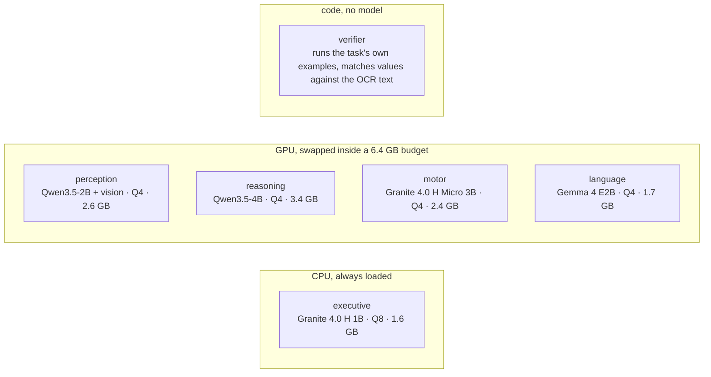
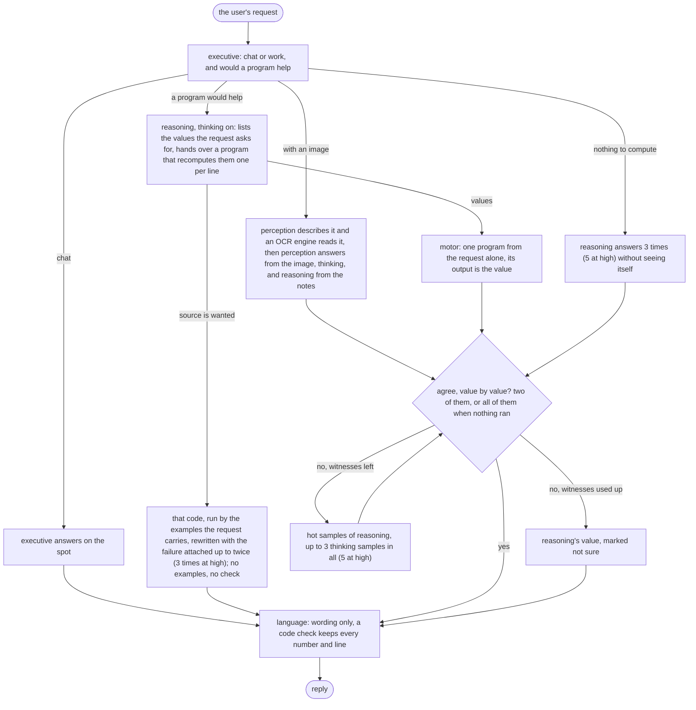

# Lobes

English | [中文](README.zh-CN.md)

Six lobes on an 8 GB laptop GPU, five small models and one checker that is plain code,
one job each. An answer counts when two of them reach it without seeing each other's
work, and what a program printed beats what a model wrote. The eval asks one question:
does that buy anything over one 9B model with no scaffolding at all? On the 320 items
both can run it scores the same, on 59% of that 9B's tokens and 55% of its seconds. On 60
harder items added afterwards, where the answer has to be computed rather than recalled, it
scores 55 and 56 against that 9B's 31 — and there it is the expensive one, at 2.5x the tokens.

## Scores

One RTX 5090, seed 0, the same items for every line, four items in flight on each box.
Bare 9B is Qwen3.5-9B as shipped, one call per item, no tools, no images. Lobes is this
runtime with the `specialists` profile, at effort medium and at high. Medium was run
twice, same code and same box, and both runs are in the table; the token and second
columns are the first run's, the second came within 1% of them.

| suite | bare 9B | Lobes, medium (two runs) | Lobes, high | tokens per item, 9B | medium | high | seconds per item, 9B | medium | high |
|---|---|---|---|---|---|---|---|---|---|
| GSM8K, 200 | 184 | 182, 181 | 181 | 10,924 | 5,308 | 7,869 | 51 | 24 | 38 |
| HumanEval, 30 | 29 | 29, 27 | 28 | 15,786 | 6,516 | 8,532 | 76 | 28 | 46 |
| tools, 30 | 25 | 30, 30 | 30 | 15,176 | 8,134 | 19,867 | 72 | 35 | 95 |
| multistep, 30 | 25 | 27, 25 | 26 | 19,182 | 14,248 | 24,791 | 88 | 61 | 123 |
| SimpleQA, 30 | 5 | 4, 3 | 2 | 20,349 | 19,841 | 45,388 | 86 | 81 | 226 |
| OCRBench, 50 | no images | 36, 37 | 36 | | 11,109 | 15,857 | | 54 | 70 |
| the 320 the 9B runs | 268 | 272, 266 | 267 | 13,436 | 7,887 | 14,160 | 62 | 34 | 70 |

The point of the split was the same answers for fewer tokens and less time, from models an
8 GB laptop GPU can hold. That is what it got, and no more. The two medium runs score 272
and 266 on the 320 items the 9B also runs, against the 9B's 268, so on score they are
level, and high at 267 lands in the same band. The cost is not level: 7,887 and 7,813
tokens an item against 13,436, 34.0 and 34.3 seconds against 62.2. It also answers the 50
image items the 9B cannot take at all.

Two results clear that spread. Tools is 30/30 in both runs against 25/30, and it is the
only suite where no item changed verdict between the runs. SimpleQA is a hedge test: the 9B
answers all 30 and is wrong on 25, while this runtime abstains on 25 and 24 and answers
wrong on 4 and 5. Everything else is inside the noise, GSM8K at 182 and 181 against 184
included. High is not worth running either: it sits inside the medium spread and costs
80% more tokens, because none of these suites needs more than medium's 6000-token
thinking budget.

Eleven of the 370 items came out differently between the two medium runs, and only 224
ended on the same answer string. llama-server runs four items at once, batch composition
changes the floating-point reductions, and one seed does not pin one token stream.

## The harder half

Two of the suites above were at a ceiling: this runtime had scored 30/30 on tools in every run
for two versions, which measures nothing. So 30 harder items were written for each, with the
old 30 left untouched so the numbers above still stand. Every expected value is computed in
`eval/suites/make.py` and none is typed in. The new tools items need a computation long enough
that no model this size reaches it by writing; the new multistep items are 4 to 6 step chains
asking for three values each. Same box, same seed, same four workers, medium run twice.

| the 30 added to each suite | bare 9B | Lobes, medium (two runs) | Lobes, high | tokens per item, 9B | medium | high | seconds per item, 9B | medium | high |
|---|---|---|---|---|---|---|---|---|---|
| tools, 30 harder | 11 | 30, 28 | 29 | 6,662 | 12,776 | 27,368 | 54 | 51 | 121 |
| multistep, 30 harder | 20 | 25, 28 | 29 | 5,260 | 16,425 | 35,747 | 41 | 68 | 162 |
| the 60 together | 31 | 55, 56 | 58 | 5,961 | 14,601 | 31,558 | 48 | 60 | 141 |

The two medium runs are 4 items apart here, the same noise as before, so tools at 30 and 28
against 11 and multistep at 25 and 28 against 20 are both real and the second is not real by
much. What the tools gap is not: both suites reward running a program and the bare 9B has no
tools, so part of those 19 points is the architecture and part is having a python interpreter.
Nothing in this eval separates the two, and the comparison is deliberately against the 9B as
you would actually run it rather than against an ablation of this runtime.

The cost claim at the top of this page does not carry onto these items and is not meant to.
Where a single sample gets the answer, splitting the work saves the 9B's long think; where it
does not, this runtime pays for several witnesses and a program each, 2.5x the tokens over the
60. It is still 1.25x on seconds rather than 2.5x, because its calls overlap where the 9B's
thinking is one serial stream. High is again not worth running: 58 against a medium band of 55
to 56, for 2.2x the tokens.

The item-level reading, the witness statistics and the pre-registered hypotheses, four of
eight failed in v3 and three of seven in v4, are in [eval/REPORT.md](eval/REPORT.md); the
rules were written down before any run, in [eval/PREREG.md](eval/PREREG.md),
[eval/PREREG-v3.md](eval/PREREG-v3.md) and [eval/PREREG-v4.md](eval/PREREG-v4.md).

## Models

One family per lobe where it does not hurt. The roster is `lobes.yaml` and nothing in
the code names a model; a lobe can also be plain code. Everything runs on this machine,
nothing is sent anywhere, and no bigger model is called when a request looks hard. On the
4070 the GPU models swap in and out of a 6.4 GB budget; the classifier sits on the CPU
and never takes part in the swapping.

## How it works

Each witness gets the user's request (and, for images, what perception and the OCR
engine read, labelled) and nothing another witness produced. A value is one line per
thing the request asks for, in that order, and two witnesses agree when every line
matches (one that printed intermediates first only has to match on its tail). Two that
agree settle it: `evidence` when one of them ran a program, `consistency` when neither
did, and once any program has run, values models wrote cannot outvote it; a request with
nothing to compute needs three samples in a row to agree. The reasoning lobe thinks and
motor answers plain: a version where both answered plain lost ten GSM8K items, and on
nine of them the two misread the same clause and agreed on the same wrong number.
The verifier lobe is code, not a model: it runs the task's own examples on code and
matches values against what the OCR engine read; nothing there votes. With an image only
perception saw it, so a pair that settles must include perception, and perception thinks
on the image as the effort says: the 2B was right 35 of 50 with thinking on and 32
without, on the same images. A witness's program that dies gets one repair with its own
stderr and that is all; only the code path rewrites more than once.
`--effort low|medium|high|xhigh|max|auto` scales thinking, witness count, rewrites and
the per-request caps; the table is in [docs/ARCHITECTURE.md](docs/ARCHITECTURE.md).

## Quick start

NVIDIA GPU, Python 3.11+. Windows gets the llama.cpp release binary; Linux builds
llama-server from source (git, cmake, nvcc on PATH).

    pip install -e .
    lobes install                   # llama.cpp + the GGUFs for the default profile
    lobes serve                     # keep this running
    lobes ask "what is 17 * 23"
    lobes ask --image shot.png "what is on this screen"
    lobes api                       # OpenAI-compatible /v1/chat/completions on :8090

`lobes models` shows what is loaded. `pip install -e .[dev,eval]` adds pytest and the
suite readers for `lobes eval`; `.[ocr]` adds the second image reader.

## Status

Verified on an RTX 4070 Laptop (8 GB): the models load and answer under grammar
constraints, the swap chain stays inside the budget, the api round-trips, screenshots
reach the perception lobe. Not done: multi-turn memory. Requests only run concurrently
where every model stays loaded, which is how the eval ran four at a time on the 5090; the
8 GB swap chain takes one request at a time.

The current design is in [docs/ARCHITECTURE.md](docs/ARCHITECTURE.md) (Chinese); what
changed along the way, and why, is in [docs/DECISIONS.md](docs/DECISIONS.md), with the
numbers of every earlier run in the appendix of [eval/REPORT.md](eval/REPORT.md). MIT.
