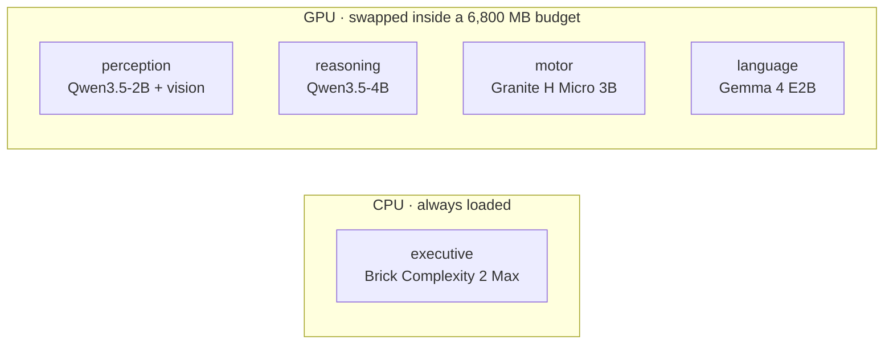

# Lobes

English | [中文](README.zh-CN.md)

Lobes is an experimental local AI runtime. It splits one assistant into small specialist models and sends each request to the one that fits it.

A company does not need its most expensive generalist for every task. It can route a math problem to one worker, an image to another, and let a program do the arithmetic. Lobes tests whether that idea is actually useful on a single consumer GPU.

The current system relays a request through five small models with one job each. The default profile fits an RTX 4070 Laptop GPU with 8 GB VRAM by swapping GPU models in and out; the executive classifier stays on CPU.

[Scores](#benchmark-results) · [Architecture](#architecture) · [How it works](#how-it-works) · [Quick start](#quick-start) · [Conclusion](#conclusion)

## Preview

Lobes solves with Qwen3.5-4B, so the comparison that matters is against that same model alone, given the same tools and the same items. Whatever separates those two columns is what the other four lobes are worth. A standalone Qwen3.5-9B, about twice the size, is there for scale.

| 100 items per suite | bare Qwen3.5-4B | Lobes, medium | bare Qwen3.5-9B |
|---|---:|---:|---:|
| GSM8K | 66 | 71 | 69 |
| IFEval | 73 | **83** | 77 |
| MBPP+ | 66 | **79** | 77 |
| GPQA diamond | 67 | 69 | 71 |
| **400 together** | 272 | **302** | 294 |

Paired over all 400 items, Lobes is right where its own solver is wrong 60 times and wrong where it is right 30 times, a net 30 items at McNemar p = 0.002. It is also faster than that solver on three of the four suites. Against the 9B the score is a tie, 43 against 35 at p = 0.428: a 4B relay lands level with a model twice its size.

The gain is uneven across the four. MBPP+ is the clearest case: +13 items, p = 0.004, and there the bare 4B reads 1,037k prompt tokens against the relay's 562k because it carries every tool result in its own conversation and prefills it again each turn. GPQA is the flat one: +2 items, p = 0.815. It rewards recall, calls a tool about twice an item, and leaves a relay almost nothing to divide up.

All four are 100-item samples taken at an even stride through each published set, seed 0, the same items for every column, measured on an RTX 5090 with four requests in flight. Timings from that box are not what a single user sees; the 4070 numbers are below.

---

## Why this project exists

Small local models are cheap to run, but any one of them is unreliable across every kind of task. A larger model is more capable, but paying for the larger model on every request is wasteful when many requests are simple or can be checked by a program.

Lobes tries a middle ground:

- give each lobe one job and let it decide how to do it;
- let the model that solves call a program instead of computing in its head;
- cap the tokens, model calls and time of every request, with no automatic escalation;
- keep the model roster configurable, with no model family hardcoded into the runtime.

This is an experiment. I make no claim that modular systems always beat larger models. The repository keeps the failed hypotheses and noisy runs because those were part of the result too.

## Architecture

The default `specialists` profile mixes model families on purpose, where that does not cost much.

| lobe | implementation | job |
|---|---|---|
| executive | Brick Complexity 2 Max, Q8, CPU resident | grade the request; a clear easy skips the review, everything else does not |
| perception | Qwen3.5-2B + vision projector | describe images and copy out their text |
| reasoning | Qwen3.5-4B | work the request out and write the reply; runs `python` itself |
| motor | Granite 4.0 H Micro 3B | the tool hand: runs the calls reasoning asks for, then answers from the results and keeps them |
| language | Gemma 4 E2B | read the finished draft against the request and say what is wrong with it |

The exact model mapping lives in [`lobes.yaml`](lobes.yaml). The orchestration code does not hardcode model names, so the same runtime can be tested with different rosters.



More implementation detail is in [`docs/ARCHITECTURE.en.md`](docs/ARCHITECTURE.en.md).

## How it works

A request first reaches the executive. From there it follows one of a small number of paths; the system does not run every model every time.


Each lobe is told what it is responsible for and what it hands on, and decides for itself how to do it. Reasoning is the only lobe that answers the user; perception writes observations into its brief, motor carries out the tool calls it asks for in words, and language reads the finished draft. A rejection from language is written into the trace and the draft still ships: over three 250-item runs the rewrite it used to trigger rescued no answers and broke two.

A reply that runs out of room mid-sentence is asked for its conclusion alone, and that is appended to the draft. A conclusion that runs out of room in its turn is dropped, because a reader takes the last block for the answer. A request that spends its whole budget without producing a draft gets one more turn to answer from the conversation it already has, so that what it read and worked out reaches the reader instead of a line saying it could not finish.

`--effort low|medium|high` sets the thinking budget per call (1,024, 4,096 and 8,192 tokens) and the request's caps on generated tokens, model calls and seconds. The relay is the same at every level and nothing escalates on its own; `auto`, `xhigh` and `max` are kept as aliases. The seconds limit stops new calls but does not interrupt a model load or a tool run, so a request can take longer. The exact policy is documented in [`docs/ARCHITECTURE.en.md`](docs/ARCHITECTURE.en.md).

## Benchmark results

Every column uses seed 0, the same 100 items per suite, and four requests in flight on an RTX 5090. The items are taken at an even stride through each published set, because the files group items by kind and the first 100 would all be one kind. Both baselines are the model as shipped, with the same eight tools Lobes has and no other lobe around it.


| suite | bare 4B | Lobes | bare 9B | median s, 4B | Lobes | 9B | prompt / item, 4B | Lobes | 9B |
|---|---:|---:|---:|---:|---:|---:|---:|---:|---:|
| GSM8K | 66 | 71 | 69 | 11.6 | 7.6 | 5.7 | 1,900 | 1,940 | 1,810 |
| IFEval | 73 | **83** | 77 | 10.1 | 7.4 | 4.7 | 2,060 | 2,250 | 2,110 |
| MBPP+ | 66 | **79** | 77 | 9.4 | 7.9 | 4.1 | 10,370 | 5,620 | 900 |
| GPQA diamond | 67 | 69 | 71 | 57.6 | 59.6 | 42.2 | 11,170 | 7,250 | 7,680 |
| **400 together** | **272** | **302** | **294** | | | | | | |

Paired against its own solver, suite by suite: MBPP+ +13 (p = 0.004), IFEval +10 (p = 0.087), GSM8K +5 (p = 0.424), GPQA +2 (p = 0.815). Only MBPP+ clears significance alone. The case rests on the 400 items together, where 60 go one way and 30 the other, p = 0.002.

Per-suite notes:

- MBPP+ shows the split most plainly. The bare 4B prefills 10,370 tokens an item against the relay's 5,620: every tool result stays in its conversation and is sent again on the next turn. The relay's tool hand keeps the results and hands over a few sentences.
- GPQA is the flat suite, and it should be. It asks what a model already knows and calls a tool about twice an item, which leaves a relay nothing to divide up.
- The 9B prefills 900 tokens an item on MBPP+ against the 4B's 10,370, because it mostly writes the answer instead of reaching for tools. That is how it reaches 77 there while the bare 4B gets 66.
- Lobes is faster than its own solver on GSM8K, IFEval and MBPP+, and 3% slower on GPQA. It is slower than the 9B on all four here. With one request at a time on the 4070 that reverses; see below.

### On the 4070

The card this targets is an RTX 4070 Laptop with 8 GB. Both arms were run there end to end, one request at a time, 250 items each on the older suite set: Lobes 195, the bare 9B 199, which McNemar cannot separate (p = 0.683). A typical request took 12.6 s against the 9B's 16.7 s, and Lobes was the faster one on 169 of the 250 items. It writes about 11% more tokens and emits them at 53.9 tok/s against 37.9, because the 4B decodes at 61.1 tok/s where the 9B manages 40.6.

The 9B fits this card: 5,187 MB measured against a 6,800 MB budget, resident, with no swapping. None of the above is a memory argument.

Earlier rounds ran against a different runtime, one that drew several reasoning samples and checked them against generated programs. Their per-suite analysis, deviations and witness statistics are in [`eval/REPORT.md`](eval/REPORT.md), and the rules for each were written before running it: [`eval/PREREG.md`](eval/PREREG.md), [`eval/PREREG-v3.md`](eval/PREREG-v3.md), and [`eval/PREREG-v4.md`](eval/PREREG-v4.md). Those numbers are kept as they were measured and do not describe the relay above.

## Conclusion

The relay earns its keep against the model inside it. Over 400 paired items it is right where the bare 4B is wrong 60 times and wrong where it is right 30 times, p = 0.002, and it is faster on three of the four suites. That is the claim this repository is for, and it is the only one measured against a control that shares a solver.

Against the 9B the score is a tie, 43 against 35, p = 0.428. The 9B fits the same 8 GB card, so there is no memory argument to make. What the 4070 run shows is speed: a typical request finishes in 12.6 s against 16.7 s at a score McNemar cannot separate.

The four did not gain equally. GPQA rewards recall and calls a tool about twice an item; the relay adds two items to it. MBPP+ hands back a lot of tool output, and the relay adds thirteen while reading half the prompt tokens. The second model pays for itself where it holds tool results the first one would otherwise carry in its own conversation.

The most useful result for me is still that the system improved when I took "AI" out of it. The verifier was a model and is now gone, the executive became a small CPU classifier, and the review model's rewrite went after it rescued nothing over three runs and broke two answers. Several preregistered ideas failed and were removed.

## Quick start

Requirements: NVIDIA GPU, Python 3.11+. Windows uses a llama.cpp release binary; Linux builds `llama-server` from source and needs git, cmake, and nvcc on `PATH`.

```bash
pip install -e .
lobes install
lobes serve
```

Then, in another terminal:

```bash
lobes ask "what is 17 * 23"
lobes ask --image shot.png "what is on this screen"
lobes api
```

`lobes api` exposes an OpenAI-compatible `/v1/chat/completions` endpoint on port 8090. With the model name `lobes-v1`, a router hands each request to one expert model; the thinking streams as `reasoning_content`, and when the request carries `tools`, the tool calls go back to the client to run. `lobes models` shows the current model state. `pip install -e .[dev,eval]` adds the test/evaluation dependencies; `.[ocr]` adds RapidOCR as the second image reader.

> [!WARNING]
> Lobes can execute model-generated Python and shell commands. The current runner is intentionally **not sandboxed**. Started as root it runs them as `nobody`, so nothing the model writes can act on the machine as a whole; started as yourself they run with your permissions. Use a container or disposable environment if you do not trust the workload.

File tools are restricted to the run work directory, but Python and shell are not. Tool execution has a 10-second timeout.

## Reproducing the experiment

The benchmark code, preregistration notes, and report are under `eval/`.

```bash
pip install -e .[dev,eval]
pytest -q
lobes eval --help
```

GitHub Actions also runs the unit tests plus the standalone checks for the tool and evaluation modules on every push and pull request.

The repository intentionally does not keep every large per-item trace in git. Release artifacts can contain the full JSONL results when needed.

## Project status

Verified locally on an RTX 4070 Laptop GPU with 8 GB VRAM:

- model swapping stays inside the configured 6,800 MB GPU budget;
- the CPU classifier remains resident;
- local text and image requests work;
- the OpenAI-compatible API round-trips;
- OCR and screenshot paths reach the perception lobe;
- the test suite runs in CI.

Current limitations:

- no multi-turn memory;
- the 8 GB swap configuration handles one request at a time;
- concurrent evaluation requires enough VRAM to keep the needed models resident;
- SimpleQA-style factual recall remains weak;
- Python/shell execution is not sandboxed;
- generated source code is returned without being run or tested.

## Repository map

- [`lobes/`](lobes/): runtime, model management, API, tools, and lobe implementations
- [`lobes.yaml`](lobes.yaml): model roster, providers, VRAM budget, and profiles
- [`eval/`](eval/): suites, preregistration, evaluation harness, and report
- [`docs/ARCHITECTURE.en.md`](docs/ARCHITECTURE.en.md): current design in English
- [`docs/ARCHITECTURE.md`](docs/ARCHITECTURE.md): current design in Chinese
- [`tests/`](tests/): unit tests

## A longer walkthrough

The quick start above is three commands. This section takes them apart, which is what you want the first time through.

### Before you install

You need an NVIDIA card and Python 3.11 or newer. 8 GB of VRAM runs the default `specialists` profile. Below that you have to lower `llama.vram_budget_mb` in `lobes.yaml` and the `vram_mb` on each model yourself.

Windows downloads a prebuilt llama.cpp, so you need no compiler. Linux builds `llama-server` from source, so `git`, `cmake` and `nvcc` have to be on `PATH`. Miss one and the first step stops there.

### Install

```bash
pip install -e .
lobes install
```

`lobes install` fetches llama.cpp and the models the current profile uses, then writes `models/models.ini`. The models come to several GB, so the first run takes a while. If it dies partway, run it again; whatever finished downloading is not fetched twice.

To fetch one profile's models only:

```bash
lobes install --profile specialists
```

Add `--skip-llama` if you put llama.cpp in place yourself.

### Start the server

```bash
lobes serve
```

This holds the terminal, so leave it open. It starts llama.cpp's router on port 8080 with no model loaded, waiting to load and unload on demand. Every `lobes serve` rewrites `models/models.ini`, so a change to the models in `lobes.yaml` takes effect on a restart.

### Ask it something

In a second terminal:

```bash
lobes ask "write me a snake game in python"
```

The first request is slow because the model has to go into VRAM before it can start. While the model stays loaded, the next one begins answering right away.

With an image:

```bash
lobes ask --image shot.png "what is on this screen"
```

To let it think longer:

```bash
lobes ask --effort high "sort this CSV by the third column and average each group"
```

`--effort` takes low, medium or high and defaults to medium. A level sets how long reasoning may think per call and the caps on the whole request. The shape of the relay stays the same.

To see what is in VRAM right now:

```bash
lobes models
```

### Optional extras

```bash
pip install -e ".[ocr]"        # adds RapidOCR as a second reader for text in images
pip install -e ".[dev,eval]"   # what the tests and the benchmark need
```

### Connect Codex

Start the API first:

```bash
lobes api
```

It opens three endpoints on port 8090: `/v1/chat/completions`, `/v1/responses` and `/v1/models`. Codex uses `/v1/responses`.

Then write `~/.codex/config.toml`:

```toml
model = "lobes/specialists"
model_provider = "lobes"
model_reasoning_effort = "medium"

[model_providers.lobes]
name = "Lobes"
base_url = "http://127.0.0.1:8090/v1"
wire_api = "responses"
```

Stop `base_url` at `/v1`. Codex appends `/responses` itself, and spelling it out gives you a 404.

`model` holds a profile, written `lobes/<profile>`. `lobes.yaml` currently has `specialists` (the default), `shared`, `v1`, `bare-9b`, `bare-4b`, `single-9b` and `single-4b`. `lobes-v1` is an alias for `v1`.

`model_reasoning_effort` reaches the levels above, with `auto`, `xhigh` and `max` read as medium, high and high. Codex sometimes sends `minimal`, which Lobes does not recognise, so the default in `lobes.yaml` applies.

There is no `env_key` here because `api.py` and `responses.py` hold no auth code and never look at a key. Put any string there if your client insists on one.

On the turns where Codex brings its own tools, the tool calls go back to Codex to run.

### Connect DeepSeek Harness

The harness speaks chat completions, so the same port 8090 covers it.

Add this to `$DSH_HOME/settings.yaml`:

```yaml
llm-pi-ai:
  providers:
    lobes:
      api: openai-completions
      baseURL: http://127.0.0.1:8090/v1
      models:
        - id: lobes/specialists
```

The provider then shows up in the model picker, and picking a model once makes it the default for new sessions.

Every turn, the harness sends its workspace and policy snapshot as a user message. Lobes recognises it through the `CONTEXT` constant in `api.py` and folds the latest one into the system prompt instead of answering it as a new request.

### When it gets stuck

Without `lobes serve` running, `lobes ask` cannot reach port 8080.

When VRAM runs out the model manager raises instead of quietly going over budget. Lower `vram_budget_mb`, or give a model `resident: true` so it never gets unloaded.

Every request writes its whole run to `runs/<task_id>/trace.jsonl`, one line per step, with each tool's raw output stored as its own json. Read that file first when an answer comes out wrong.

MIT License.