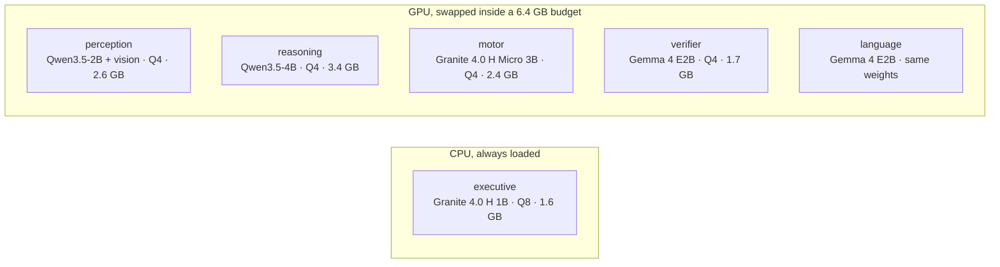

# Lobes

English | [中文](README.zh-CN.md)

Six small models on an 8 GB laptop GPU, one job each. An answer counts when two of
them reach it without seeing each other's work, and what a program printed beats what
a model wrote. The eval asks one question: does that buy anything over one 9B model
with no scaffolding at all?

## Scores

One RTX 5090, seed 0, the same items for every line, four items in flight on each box.
Bare 9B is Qwen3.5-9B as shipped, one call per item, no tools. v3 is this runtime with
the `specialists` profile at effort medium. Suites appear as their runs finish: SimpleQA,
OCRBench and multistep for v3, the high run, and the second version with the v3 intake
are still going.

| suite | bare 9B | v3, medium | tokens per item, 9B | tokens, v3 | seconds per item, 9B | seconds, v3 |
|---|---|---|---|---|---|---|
| GSM8K, 200 | 184 | 181 | 10,924 | 6,805 | 51 | 31 |
| HumanEval, 30 | 29 | 28 | 15,786 | 6,893 | 76 | 32 |
| tools, 30 | 25 | 27 | 15,176 | 8,572 | 72 | 36 |
| those three, 260 | 238 | 236 | 11,976 | 7,019 | 56 | 31 |

The point of the split was the same answers for fewer tokens and less time, from models
an 8 GB laptop GPU can hold. On the three suites in so far that is 41% fewer tokens and
44% less time for two items out of 260, and more correct on tools. Of the 19 GSM8K
misses, 12 are items the 9B misses too. The item-level reading, the witness statistics
and the pre-registered hypotheses are in [eval/REPORT.md](eval/REPORT.md); the rules were
written down before any run, in [eval/PREREG.md](eval/PREREG.md) and
[eval/PREREG-v3.md](eval/PREREG-v3.md).

## Milestones

All on 2026-09-14, in order. The first three are on the first suite sizes, one item at a
time; v3 is on the enlarged suites, and the two rulers are not comparable with each other.

- **v1**, morning. Six lobes around a shared blackboard: the executive writes a plan,
  motor runs tools, reasoning answers, the verifier re-solves blind, language words
  it. Built and run on the 4070; on the 5090 it scored 74/90 on the four suites the
  9B runs. Tag `v1-4070`.
- **v2**, afternoon. Fixes from reading the v1 traces, rules in
  [eval/PREREG-v2.md](eval/PREREG-v2.md). 78/90 at medium.
- **v2 at effort high: 82/90 against the 9B's 84/90, on 60% of its tokens and 73% of
  its seconds.** Tools 20/20 against 18/20, the first suite where the split beat the
  single model. HumanEval 26 against 27, GSM8K 27 against 29, multistep 9 against 10.
- **v3**, evening. The blackboard goes: every witness gets the goal and nothing another
  witness produced, and two that agree settle it
  ([eval/PREREG-v3.md](eval/PREREG-v3.md)). The 1.2B executive, which classified 157
  of 341 test prompts, gives way to a 1B Granite that gets 330.
- **v3 at medium on the enlarged suites, three suites in: 236 against the 9B's 238 on
  59% of its tokens and 56% of its seconds, tools 27/30 against 25/30.** The rest of the
  suites and the high run are still going.

The second version on the first suite sizes, for the record:

| suite | bare 9B | v2, medium | v2, high |
|---|---|---|---|
| GSM8K | 29/30 | 27/30 | 27/30 |
| HumanEval | 27/30 | 24/30 | 26/30 |
| tools | 18/20 | 18/20 | 20/20 |
| multistep | 10/10 | 9/10 | 9/10 |
| SimpleQA | 2/30 | 3/30 | 2/30 |
| OCRBench | no images | 12/20 | 12/20 |
| the four the 9B runs | 84/90 | 78/90 | 82/90 |
| tokens per item, those four | 12,279 | 3,763 | 7,426 |
| seconds per item, those four | 32 | 11 | 24 |

## Models

One family per lobe where it does not hurt. The roster is `lobes.yaml` and nothing in
the code names a model; a lobe can also be plain code. Everything runs on this machine,
nothing is sent anywhere, and no bigger model is called when a task looks hard. On the
4070 the GPU models swap in and out of a 6.4 GB budget; the classifier sits on the CPU
and never takes part in the swapping.

## How it works

Each witness gets the goal (and, for images, what perception and the OCR engine read,
labelled) and nothing another witness produced. A value is one line per thing the goal
asks for, in that order, and two witnesses agree when every line matches (one that
printed intermediates first only has to match on its tail). Two that agree settle it:
`evidence` when one of them ran a program, `consistency` when neither did; a
closed-book answer needs three samples in a row to agree. Thinking stays off until the cheap witnesses
disagree. A program that dies gets one repair with its own stderr and that is all. `--effort
low|medium|high|xhigh|max|auto` scales thinking, witness count, repairs and the
per-item caps; the table is in [docs/ARCHITECTURE.md](docs/ARCHITECTURE.md).

## Quick start

NVIDIA GPU, Python 3.11+. Windows gets the llama.cpp release binary; Linux builds
llama-server from source (git, cmake, nvcc on PATH).

    pip install -e .
    lobes install                   # llama.cpp + the GGUFs for the default profile
    lobes serve                     # keep this running
    lobes ask "what is 17 * 23"
    lobes ask --image shot.png "what is on this screen"
    lobes api                       # OpenAI-compatible /v1/chat/completions on :8090

`lobes models` shows what is loaded. `pip install -e .[dev,eval]` adds pytest and the
suite readers for `lobes eval`; `.[ocr]` adds the second image reader.

## Status

Verified on an RTX 4070 Laptop (8 GB): the models load and answer under grammar
constraints, the swap chain stays inside the budget, the api round-trips, screenshots
reach the perception lobe. Not done: multi-turn memory, anything concurrent.

Design notes in [docs/ARCHITECTURE.md](docs/ARCHITECTURE.md) (Chinese), what changed
and why in [docs/DECISIONS.md](docs/DECISIONS.md). MIT.
