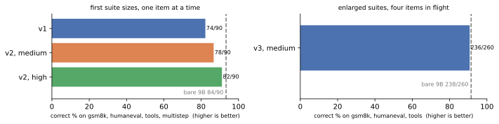
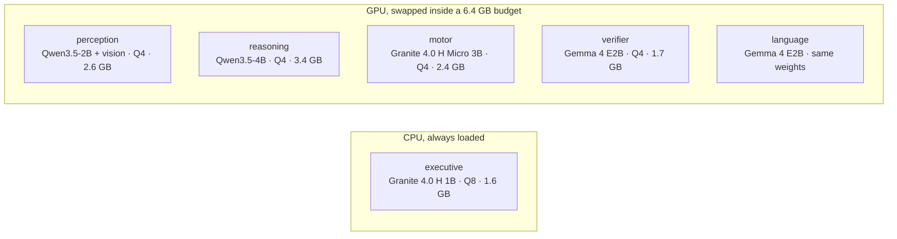
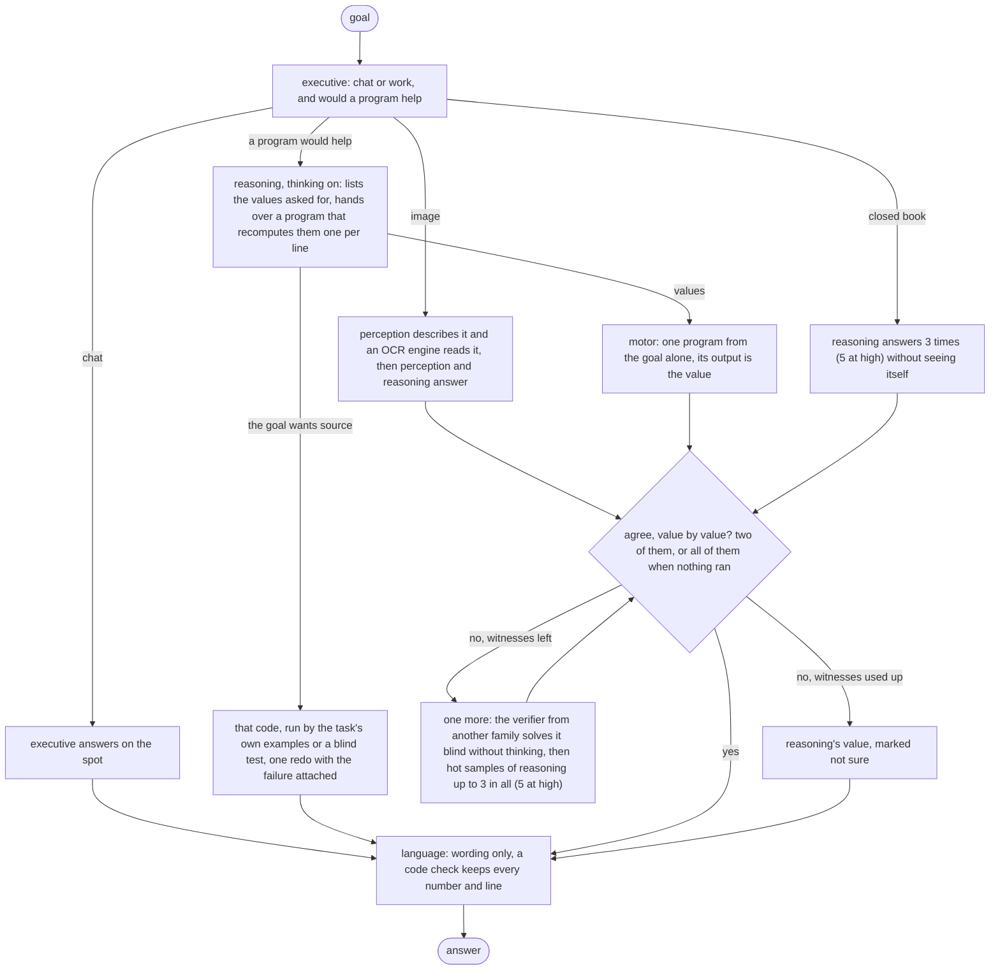

# Lobes

English | [中文](README.zh-CN.md)

Six small models on an 8 GB laptop GPU, one job each. An answer counts when two of
them reach it without seeing each other's work, and what a program printed beats what
a model wrote. The eval asks one question: does that buy anything over one 9B model
with no scaffolding at all?

## Scores

One RTX 5090, seed 0, the same items for every line, four items in flight on each box.
Bare 9B is Qwen3.5-9B as shipped, one call per item, no tools, no images. v3 is this
runtime with the `specialists` profile, at effort medium and at high. The charts also
carry v2, the second version at high with the v3 intake.

| suite | bare 9B | v3, medium | v3, high | tokens per item, 9B | medium | high | seconds per item, 9B | medium | high |
|---|---|---|---|---|---|---|---|---|---|
| GSM8K, 200 | 184 | 177 | 182 | 10,924 | 6,557 | 8,176 | 51 | 27 | 37 |
| HumanEval, 30 | 29 | 27 | 28 | 15,786 | 8,382 | 16,114 | 76 | 37 | 74 |
| tools, 30 | 25 | 30 | 30 | 15,176 | 7,809 | 17,311 | 72 | 34 | 74 |
| multistep, 30 | 25 | 25 | 25 | 19,182 | 16,659 | 26,408 | 88 | 70 | 121 |
| SimpleQA, 30 | 5 | 2 | 2 | 20,349 | 19,237 | 38,989 | 86 | 79 | 177 |
| OCRBench, 50 | no images | 30 | 30 | | 8,925 | 12,909 | | 41 | 49 |
| the 320 the 9B runs | 268 | 261 | 267 | 13,436 | 8,981 | 14,375 | 62 | 38 | 65 |

The point of the split was the same answers for fewer tokens and less time, from models
an 8 GB laptop GPU can hold. At medium it is seven items behind the 9B on 320, for 33%
fewer tokens and 39% less time; at high it is one item behind, for 7% more tokens and
4% more time. Tools is the suite the split wins outright, 30/30 at both levels against
25/30. GSM8K is where it loses: 11 of high's 18 misses are items the 9B misses too, and
the rest are mostly two witnesses agreeing on the same misreading. SimpleQA is a hedge
test: the 9B answers all 30 and is wrong on 25; v3 abstains on 22 (26 at high) and is
wrong on 5 (3). The item-level reading, the witness statistics and the pre-registered
hypotheses, six of eight failed, are in [eval/REPORT.md](eval/REPORT.md); the rules were
written down before any run, in [eval/PREREG.md](eval/PREREG.md) and
[eval/PREREG-v3.md](eval/PREREG-v3.md).

## Milestones

2026-09-14 and 15, in order. Every number is on the items of the table above.

- **v1**, 09-14 morning. Six lobes around a shared blackboard: the executive writes a
  plan, motor runs tools, reasoning answers, the verifier re-solves blind, language
  words it. Built and run on the 4070. Tag `v1-4070`.
- **v2**, afternoon. Fixes from reading the v1 traces, rules in
  [eval/PREREG-v2.md](eval/PREREG-v2.md). 234/320 at medium, with the 1.2B classifier
  it shipped with (tag `pre-v3`).
- **v2 at high with the v3 intake: 241/320, tools 29/30 against the 9B's 25/30, the
  first suite where the split beat the single model.** Multistep 17/30 against 25/30,
  at 20,000 tokens an item. Branch `v2-fix`.
- **v3**, evening. The blackboard goes: every witness gets the goal and nothing another
  witness produced, and two that agree settle it
  ([eval/PREREG-v3.md](eval/PREREG-v3.md)). The 1.2B executive, which classified 157
  of 341 test prompts, gives way to a 1B Granite that gets 330.
- **v3 at medium: 261 against the 9B's 268 on 67% of its tokens and 61% of its seconds;
  tools 30/30 against 25/30, multistep 25 against 25.** Reading its traces on 09-15
  changed the contract five times (one value per line, a program that ran cannot be
  outvoted, the reasoning lobe thinking from its first sample); each version's partial
  run is kept and read in [eval/REPORT.md](eval/REPORT.md), deviations 13 to 15.
- **v3 at high: 267 against 268 on 107% of the 9B's tokens and 104% of its seconds;
  GSM8K 182 against 184, HumanEval 28 against 29, tools 30 against 25, multistep 25
  against 25.** What the split buys is medium: the same answers minus seven for two
  thirds of the tokens. What it does not buy is a better GSM8K than the 9B on its own.

## Models

One family per lobe where it does not hurt. The roster is `lobes.yaml` and nothing in
the code names a model; a lobe can also be plain code. Everything runs on this machine,
nothing is sent anywhere, and no bigger model is called when a task looks hard. On the
4070 the GPU models swap in and out of a 6.4 GB budget; the classifier sits on the CPU
and never takes part in the swapping.

## How it works

Each witness gets the goal (and, for images, what perception and the OCR engine read,
labelled) and nothing another witness produced. A value is one line per thing the goal
asks for, in that order, and two witnesses agree when every line matches (one that
printed intermediates first only has to match on its tail). Two that agree settle it:
`evidence` when one of them ran a program, `consistency` when neither did, and once any
program has run, values models wrote cannot outvote it; a closed-book answer needs three
samples in a row to agree. The reasoning lobe thinks; motor and the verifier answer
plain, because two plain programs from the same family misread a question the same
way and agreed on the wrong number ten times in two hundred. A program that dies gets one repair with its own stderr and that is all. `--effort
low|medium|high|xhigh|max|auto` scales thinking, witness count, repairs and the
per-item caps; the table is in [docs/ARCHITECTURE.md](docs/ARCHITECTURE.md).

## Quick start

NVIDIA GPU, Python 3.11+. Windows gets the llama.cpp release binary; Linux builds
llama-server from source (git, cmake, nvcc on PATH).

    pip install -e .
    lobes install                   # llama.cpp + the GGUFs for the default profile
    lobes serve                     # keep this running
    lobes ask "what is 17 * 23"
    lobes ask --image shot.png "what is on this screen"
    lobes api                       # OpenAI-compatible /v1/chat/completions on :8090

`lobes models` shows what is loaded. `pip install -e .[dev,eval]` adds pytest and the
suite readers for `lobes eval`; `.[ocr]` adds the second image reader.

## Status

Verified on an RTX 4070 Laptop (8 GB): the models load and answer under grammar
constraints, the swap chain stays inside the budget, the api round-trips, screenshots
reach the perception lobe. Not done: multi-turn memory, anything concurrent.

Design notes in [docs/ARCHITECTURE.md](docs/ARCHITECTURE.md) (Chinese), what changed
and why in [docs/DECISIONS.md](docs/DECISIONS.md). MIT.
