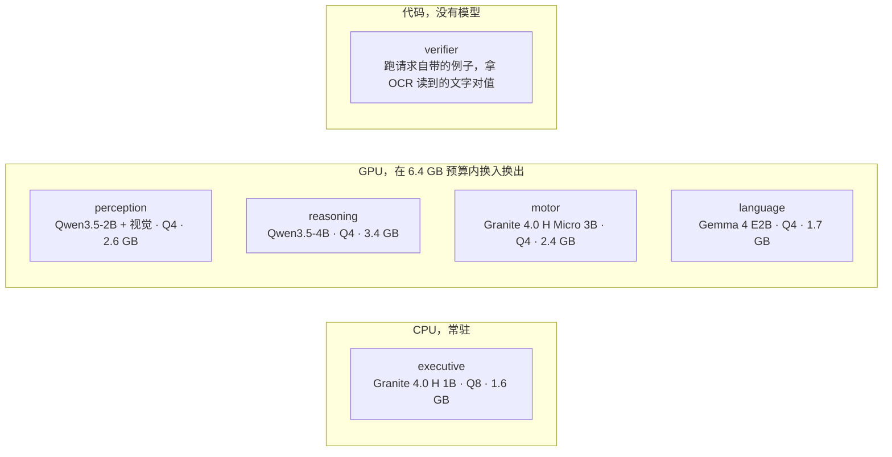
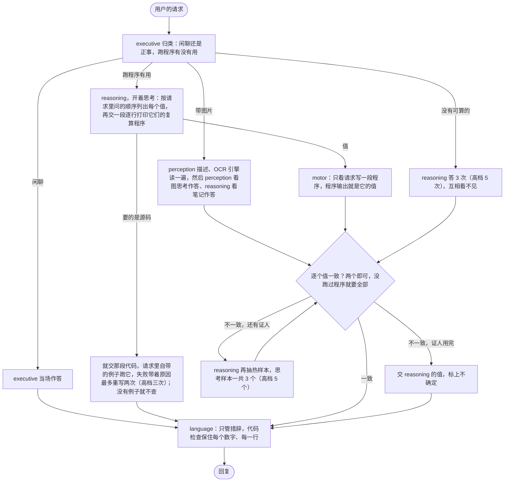

# Lobes

[English](README.md) | 中文

六个脑叶跑在一张 8 GB 的笔记本显卡上，五个小模型加一段纯代码的检查，一个只管一件事。
两个在互相看不见对方的情况下得出同一个答案，这个答案才算数；程序打印出来的结果比模型
写出来的文字更可信。
评测只问一个问题：这样拆开，比一个什么都不套的 9B 模型到底强在哪。
在两边都能跑的 320 道题上，成绩和那个 9B 打平，token 只花了它的 59%，时间只花了 55%。
后来补的 60 道更难的题上——答案得算出来，不是想出来——它是 55 和 56 对那个 9B 的 31，
而在这批题上它是贵的那个，token 要花 2.5 倍。

## 成绩

一张 RTX 5090，seed 0，每条线同一批题，每台机器 4 道题并行。裸 9B 是原样的
Qwen3.5-9B，每题一次调用，不给工具、不看图。Lobes 是这套运行时的 `specialists` 配置。
中档同一份代码、同一台机跑了两遍，两遍都列在表里；token 和秒数那几列是第一遍的，第二遍
和它差不到 1%。

| 题库 | 裸 9B | Lobes 中档（两遍） | Lobes 高档 | 每题 token，9B | 中档 | 高档 | 每题秒，9B | 中档 | 高档 |
|---|---|---|---|---|---|---|---|---|---|
| GSM8K，200 道 | 184 | 182、181 | 181 | 10,924 | 5,308 | 7,869 | 51 | 24 | 38 |
| HumanEval，30 道 | 29 | 29、27 | 28 | 15,786 | 6,516 | 8,532 | 76 | 28 | 46 |
| tools，30 道 | 25 | 30、30 | 30 | 15,176 | 8,134 | 19,867 | 72 | 35 | 95 |
| multistep，30 道 | 25 | 27、25 | 26 | 19,182 | 14,248 | 24,791 | 88 | 61 | 123 |
| SimpleQA，30 道 | 5 | 4、3 | 2 | 20,349 | 19,841 | 45,388 | 86 | 81 | 226 |
| OCRBench，50 道 | 不看图 | 36、37 | 36 | | 11,109 | 15,857 | | 54 | 70 |
| 9B 跑的 320 道合计 | 268 | 272、266 | 267 | 13,436 | 7,887 | 14,160 | 62 | 34 | 70 |

拆开的初衷就是用 8 GB 笔记本显卡装得下的模型，花更少的 token 和时间给出同样的答案。
做到的就是这些，再多没有了。两遍中档在 9B 也跑的那 320 道上是 272 和 266，9B 是 268，
成绩上打平，高档的 267 也落在同一档里。成本不是平的：每题 7,887 和 7,813 个 token 对
13,436，34.0 秒和 34.3 秒对 62.2。另外还答了 9B 根本不能看的 50 道图片题。

穿过这个波动的只有两条。tools 两遍都是 30/30 对 25/30，而且是唯一一个两遍没有一道翻面的
题库。SimpleQA 是弃答测试：9B 30 道全答、错 25 道；这套运行时弃答 25 和 24 道，答错 4
和 5 道。其余全在噪声里，包括 GSM8K 的 182 和 181 对 184。高档同样不值得开：它落在中档
两遍的区间里，token 却多 80%，因为这些题没有一道需要超过中档 6000 token 的思考预算。

370 道里有 11 道两遍结论不同，最终答案字符串只有 224 道一样：llama-server 四道题一起跑，
批次组成变了浮点归约就变，同一个种子并不锁死同一串 token。

## 更难的那一半

上面两个题库已经顶到天花板了：tools 这套运行时连着两个版本每一遍都是 30/30，这种分数
什么都量不出来。所以每个题库又写了 30 道更难的，老的 30 道一个字没动，上面的成绩照旧
成立。每个期望值都由 `eval/suites/make.py` 算出来，没有一个是手敲的。新的 tools 题，
要的那个值得算够长的一段，这个尺寸的模型靠写是写不出来的；新的 multistep 题是 4 到 6 步
的链子，每道要三个值。同一台机、同一个种子、同样 4 道并行，中档跑两遍。

| 每个题库新加的 30 道 | 裸 9B | Lobes 中档（两遍） | Lobes 高档 | 每题 token，9B | 中档 | 高档 | 每题秒，9B | 中档 | 高档 |
|---|---|---|---|---|---|---|---|---|---|
| tools，难的 30 道 | 11 | 30、28 | 29 | 6,662 | 12,776 | 27,368 | 54 | 51 | 121 |
| multistep，难的 30 道 | 20 | 25、28 | 29 | 5,260 | 16,425 | 35,747 | 41 | 68 | 162 |
| 两个合起来 60 道 | 31 | 55、56 | 58 | 5,961 | 14,601 | 31,558 | 48 | 60 | 141 |

这里两遍中档差 4 道，和之前一样的噪声，所以 tools 的 30 和 28 对 11、multistep 的 25 和
28 对 20 都是真的，只是后者真得不多。tools 那 19 分不能读成什么：这两个题库都奖励「跑一段
程序」，而裸 9B 手上没有工具，所以这里面一部分是架构带来的，一部分是有 python 解释器带来
的，这套评测分不开这两者。对手是特意选的「你实际会怎么跑这个模型」，不是这套运行时自己的
消融版。

页面开头那句成本的话不适用于这批题，也不打算适用。一次采样就能答对的题，拆开省掉了 9B
那段长思考；答不对的题，这套运行时要付几个证人加各自一段程序的钱，60 道上是 2.5 倍的
token。秒数只是 1.25 倍而不是 2.5 倍，因为它的调用是重叠的，而 9B 的思考是一条串行的流。
高档还是不值得开：58 对中档 55 到 56 的区间，token 是 2.2 倍。

逐题的分析、证人的统计和预注册假设的核对（v3 八条里四条不成立，v4 七条里三条不成立）都在
[eval/REPORT.md](eval/REPORT.md)；规则在跑之前就写死在 [eval/PREREG.md](eval/PREREG.md)、
[eval/PREREG-v3.md](eval/PREREG-v3.md) 和 [eval/PREREG-v4.md](eval/PREREG-v4.md)。

## 模型

能不伤成绩的地方一个脑叶一个家族。名单只在 `lobes.yaml` 里，代码里不出现任何模型名；
一个脑叶也可以是纯代码。全部在本机跑，什么都不往外发，请求再难也不会去叫更大的模型。
4070 上 GPU 里的模型在 6.4 GB 预算内换入换出，分类器留在 CPU，永远不参与换。

## 怎么干活

每个证人拿到的是用户的请求（带图片的另加 perception 和 OCR 各自读出的内容，标明来源），别的
证人产出的一概看不到。值的约定是一行一个、按请求里问的顺序，两个证人逐行都对上才算一致（先打印
了中间量的只比末尾）。两个一致就定案：有一个跑过程序叫 `evidence`，都没跑叫 `consistency`，但只要
有程序跑过，模型自己写的值一致不能压过它；没有可算的东西时要连续三个样本一致。reasoning 开着
思考、motor 不思考：试过让两个都不思考的那一版 GSM8K 少对十道，其中九道是这两个同读错请求里的
同一句、一致给出同一个错数。verifier 是代码不是模型：跑代码题自带的例子、拿 OCR 读到的文字
对值，不投票。带图片的请求只有 perception 看过图，定案的两个里必须有它，它看图也按档位思考
（同一批 50 张图，开思考对 35、不开对 32）。证人的程序挂了只带着 stderr 修一次，仅此而已；
只有代码路径会重写不止一遍。`--effort low|medium|high|xhigh|max|auto` 一起调思考长度、
证人数量、重写次数和单次请求的上限，表在 [docs/ARCHITECTURE.md](docs/ARCHITECTURE.md)。

## 快速开始

NVIDIA 显卡，Python 3.11+。Windows 直接下 llama.cpp 的发布版二进制；Linux 从源码编
llama-server（PATH 里要有 git、cmake、nvcc）。

    pip install -e .
    lobes install                   # llama.cpp + 默认配置要的 GGUF
    lobes serve                     # 一直开着
    lobes ask "what is 17 * 23"
    lobes ask --image shot.png "what is on this screen"
    lobes api                       # OpenAI 兼容的 /v1/chat/completions，端口 8090

`lobes models` 看当前装了什么。`pip install -e .[dev,eval]` 加上 pytest 和 `lobes eval`
要的题库读取器；`.[ocr]` 加第二个读图引擎。

## 状态

在 RTX 4070 Laptop（8 GB）上验证过：模型能装载、在语法约束下作答，换入换出不超预算，
api 能来回，截图能到 perception。没做：多轮记忆。并发只有在所有模型都常驻时才行，评测在
5090 上就是这么 4 道题一起跑的；8 GB 的换入换出一次只能跑一个请求。

现在的设计在 [docs/ARCHITECTURE.md](docs/ARCHITECTURE.md)，一路改了什么、为什么改在
[docs/DECISIONS.md](docs/DECISIONS.md)，早先每一版的数字在 [eval/REPORT.md](eval/REPORT.md)
的附录。MIT。
