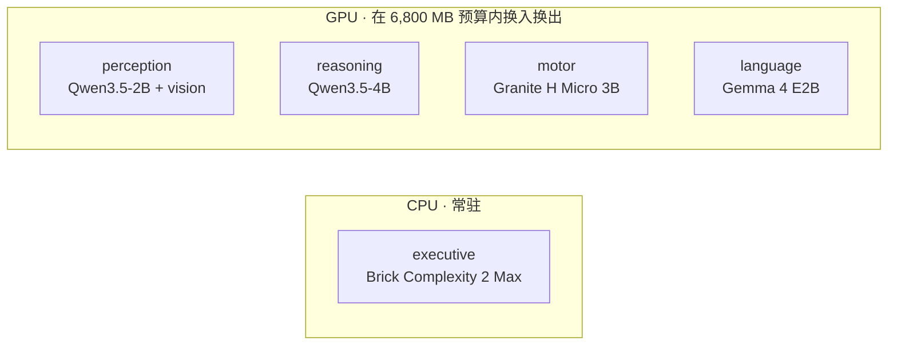
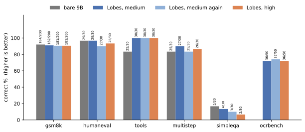
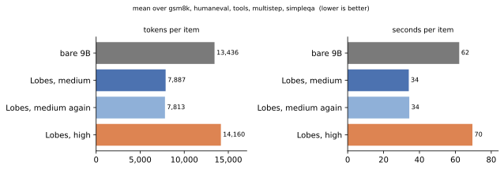

# Lobes

[English](README.md) | 中文

Lobes 是一个实验性的本地 AI 运行时。它把一个助手拆成几个小模型，每个只做一件事。

我一开始想的问题很简单：如果把 AI 当成一家公司，是不是没必要每次都叫最贵的那个全能员工？数学题交给会算的，看图交给视觉模型，算数交给程序。Lobes 就是我在一张消费级显卡上试这个想法。

现在的版本是五个小模型的一条接力，每个只有一份职责。默认配置能在 RTX 4070 Laptop 的 8 GB 显存上运行，GPU 上的模型按需换入换出，executive 分类器常驻 CPU。

[评测](#评测结果) · [架构](#架构) · [怎么工作](#怎么工作) · [快速开始](#快速开始) · [结论](#结论) · [上手教程](docs/GUIDE.md)

## 预览

Lobes 的求解叶就是 Qwen3.5-4B，所以主要的对照是同一个模型单独跑，给一样的工具、做一样的题。这两列之间的差，就是另外四个 lobe 带来的。再放一个大约两倍大的裸 Qwen3.5-9B 当参照。

| 每题库 100 道 | 裸 Qwen3.5-4B | Lobes medium | 裸 Qwen3.5-9B |
|---|---:|---:|---:|
| GSM8K | 66 | **71** | 69 |
| IFEval | 73 | **83** | 77 |
| MBPP+ | 66 | **79** | 77 |
| GPQA diamond | 67 | 69 | **71** |
| **合计 400 道** | 272 | **302** | 294 |

400 道逐题配对：自己的求解叶错、Lobes 对的有 60 道，反过来 30 道，净 30 道，McNemar p = 0.002。四个题库里有三个 Lobes 还更快。对裸 9B 是打平，43 比 35，p = 0.428。

四个题库涨得不均匀。MBPP+ 涨得最多，+13 道，p = 0.004。那里裸 4B 读进 1,037k 预填 token，Lobes 只有 562k，因为裸 4B 把每次的工具结果都留在自己的对话里，下一轮再全部发一遍。GPQA 几乎没动，+2 道，p = 0.815。它主要考模型本来就记得的东西，每题只调两次左右工具，接力没什么可分的。

四个题库各取 100 道，按等间隔穿过公开题集取号（文件里题目按类型扎堆，取前 100 会全是一类），seed 0，每一列题号相同，在一张 RTX 5090 上四路并发跑。那台机器的耗时不是单个用户的体感，4070 的数字在下面。

---

## 为什么做这个项目

小模型便宜、快，但单个小模型很难什么都做好。大模型能力更全面，不过很多请求其实很简单，或者能被程序检查，用大模型从头跑到尾有点浪费。

Lobes 试的是两者中间：

- 每个 lobe 只有一份职责，怎么做由它自己定；
- 有要算的东西时，求解的模型去调程序；
- 每个请求的 token、模型调用次数和时间都有上限，不会自动升档；
- 模型只写在配置里，换一套模型运行时照样跑。

这是一个实验项目，我没打算证明“模块化一定比大模型强”。报告里失败的想法、重复跑出来的波动都留着，和成功的放在一起。

## 架构

默认的 `specialists` profile 在不太吃亏的地方，给每个 lobe 用了不同家族的模型。

| lobe | 实现 | 主要工作 |
|---|---|---|
| executive | Brick Complexity 2 Max，Q8，CPU 常驻 | 给请求定难度；明确简单的跳过审查，其余都要走 |
| perception | Qwen3.5-2B + vision projector | 描述图片、抄出图里的文字 |
| reasoning | Qwen3.5-4B | 把请求想明白并写出回复；`python` 由它自己调 |
| motor | Granite 4.0 H Micro 3B | 工具手：执行 reasoning 要的调用，然后自己从结果里作答，结果留在它这儿 |
| language | Gemma 4 E2B | 拿写好的草稿对着请求读一遍，说哪里不对 |

具体模型都在 [`lobes.yaml`](lobes.yaml) 里。



更完整的设计在 [`docs/ARCHITECTURE.md`](docs/ARCHITECTURE.md)。

## 怎么工作

请求先到 executive，之后走几条路径里的一条，只有这条路上的模型会跑。


每个 lobe 只被告知自己负责什么、交给谁。只有 reasoning 对用户说话；perception 把观察写进它的材料，motor 执行它用话提出的工具调用，language 读写好的草稿。language 打回时只记进 trace，草稿照样交出去。以前打回会触发重写，三轮 250 道跑下来，重写一道没救回，还弄坏了两道。

回复写到一半撞上限的，会单独再要一次结论，接到草稿后面。结论也写不完就丢掉，因为读的人会把最后一段当答案。整个请求把预算用完了还没有草稿时，reasoning 会再答一次，用的是它已经读过、算过的东西。

`--effort low|medium|high` 决定单次调用的思考预算（1,024、4,096、8,192 token），以及单个请求的生成 token、模型调用次数和秒数上限。三档走的是同一条接力，`auto`、`xhigh`、`max` 作为别名保留。秒数上限只拦新的调用，不打断正在加载的模型和正在跑的工具，所以一个请求可能超过这个时间。具体策略写在 [`docs/ARCHITECTURE.md`](docs/ARCHITECTURE.md)。

## 评测结果

每一列都用 seed 0、每个题库同样的 100 道题，在一张 RTX 5090 上四路并发跑。题号按等间隔穿过公开题集取（文件里题目按类型扎堆，取前 100 会全是一类）。两条裸臂都是原样的模型，拿着和 Lobes 一样的八个工具，身边没有别的 lobe。





分数就是页面最上面那张表。

对自己的求解叶逐题配对，分题库看：MBPP+ +13（p = 0.004）、IFEval +10（p = 0.087）、GSM8K +5（p = 0.424）、GPQA +2（p = 0.815）。单独看只有 MBPP+ 是显著的，整个结论靠的是 400 道合在一起，60 道往一边、30 道往另一边，p = 0.002。

分题库说几句：

- MBPP+ 上裸 4B 每题预填 10,370 token，接力只有 5,620，因为工具结果全留在裸 4B 的对话里，下一轮又发一遍。接力里是工具手留着这些结果，只交出去几句话。
- 裸 9B 在 MBPP+ 上每题只预填 900 token。它多半直接写答案，很少去碰工具，在那里照样拿了 77，裸 4B 是 66。
- GSM8K、IFEval、MBPP+ 上 Lobes 比自己的求解叶快，GPQA 慢 3%。在这台机器上它四个题库都比裸 9B 慢；到 4070 上单请求跑就反过来了，见下。

### 在 RTX 4070 上

默认配置瞄的就是这张卡，RTX 4070 Laptop，8 GB，显存预算 6,800 MB。下面全部是单请求不并发跑出来的，也就是一个人自己用时看到的样子，题目和 seed 0 都和最上面那张表一样，共 400 道。

| 题库 | 裸 4B | Lobes | 裸 9B |
|---|---:|---:|---:|
| GSM8K | 73 | **79** | 74 |
| IFEval | 76 | **81** | 71 |
| MBPP+ | 69 | **81** | 78 |
| GPQA diamond | 64 | 71 | **74** |
| **合计 400 道** | 282 | **312** | 297 |

#### 每题秒数，中位

| 题库 | 裸 4B | Lobes | 裸 9B |
|---|---:|---:|---:|
| GSM8K | **9.7** | 13.8 | 13.6 |
| IFEval | **10.4** | 10.7 | 15.0 |
| MBPP+ | **10.6** | **10.6** | 11.0 |
| GPQA diamond | **75.4** | 77.7 | 119.8 |

#### 每题预填 token，中位

| 题库 | 裸 4B | Lobes | 裸 9B |
|---|---:|---:|---:|
| GSM8K | 2,040 | **1,542** | 2,016 |
| IFEval | 810 | 1,153 | **795** |
| MBPP+ | 3,574 | 2,186 | **824** |
| GPQA diamond | 8,242 | 5,604 | **4,708** |

每行最好的加粗；后两张表是越低越好。400 道逐题配对，裸 4B 错而接力对的有 60 道，反过来 30 道，p = 0.002，和 5090 上跑出来的是同一个比分。对裸 9B 是 47 比 32，p = 0.115。MBPP+ 的分数是拿存下来的答案离线重判的，因为跑的时候那个判分只读返回码，分不清测试没过和子进程根本没起来。

400 次请求里只有 19 次需要装卸模型，一共 65 秒，其余请求要用的模型都已经在显存里。裸 9B 在这张卡上也装得下，实测 5,187 MB，预算 6,800 MB，全程常驻不换，所以这个对比和显存装不装得下无关。

### 这些数字能信多少

每一列都只跑了一次。更早的一个版本上，同一份代码在同一台机器上连着跑两遍，90 道题分别得了 67 和 71，所以单个题库上差几道题可能只是波动。和裸 4B 的 400 道对比在第二台机器上重复过：4070 跑出来和 5090 一样，也是 60 比 30。

这几个题库不是留出来的测试集。补结论的 2,048 token 预算是在 GPQA 上调的，这里的 100 道 GPQA 是调参用的那 198 道的子集。去掉审查后的重写，是根据上面提到的那三轮 250 道定的。

`shared` profile（perception、reasoning、motor 都用同一个 4B 视觉模型，提示词不变）还没跑过评测。在跑之前，我说不清提升里有多少来自换了不同的模型，有多少来自给每一步单独写提示词。

## 结论

和它里面那个模型比，接力赢了，60 比 30 这个比分在两台机器上都跑出来了。这也是这里唯一一个对照组和它用同一个求解叶的比较。

和 9B 比，4070 上它领先，5090 上打平。两个差距都不显著，可以说它跟上了两倍大的模型。

工具产出多的题上接力帮得最多，比如 MBPP+，因为工具手把原始结果挡在了求解叶的对话外面。

4070 上它每题比自己的求解叶慢三秒左右，比裸 9B 稍快，GPQA 这种长题上快得最明显。

对我来说最有用的发现是，这套系统是在我把“AI”拿掉之后变好的。verifier 原来是个模型，现在整个删了；executive 变成了常驻 CPU 的小分类器；审查模型打回后重写这一步，三轮跑下来一道没救回、还弄坏两道，也去掉了。几条预注册的想法跑失败以后也删了。

## 快速开始

要求：NVIDIA GPU，Python 3.11+。Windows 使用 llama.cpp 的 release binary；Linux 会从源码编译 `llama-server`，需要 `git`、`cmake` 和 `nvcc` 在 `PATH`。

```bash
pip install -e .
lobes install
lobes serve
```

另开一个终端：

```bash
lobes ask "what is 17 * 23"
lobes ask --image shot.png "what is on this screen"
lobes api
```

`lobes api` 会在 8090 端口提供 OpenAI 兼容的 `/v1/chat/completions`、`/v1/responses` 和 `/v1/models`。模型名决定用哪个 profile：`lobes/specialists` 是默认那条接力，`lobes-v1` 是更早那一版，路由模型把每个请求交给一个专家模型。思考过程按 `reasoning_content` 流式输出，请求里带了 `tools` 时，工具调用交回客户端去跑。`lobes models` 可以看当前模型状态。`pip install -e .[dev,eval]` 安装测试 / 评测依赖；`.[ocr]` 会加上 RapidOCR，作为第二个图片读取器。

一步一步的版本，包括怎么接 Codex 和 DeepSeek Harness，写在 [`docs/GUIDE.md`](docs/GUIDE.md)。

> [!WARNING]
> Lobes 可以执行模型生成的 Python 和 shell 命令。runner **没有 sandbox**，只有文件工具被限制在本次 run 的工作目录里，Python 和 shell 只有一个 10 秒超时。用 root 启动时它会先降到 `nobody` 再跑，这挡得住它动你自己的文件；但 `nobody` 照样能上网，也能读任何 world-readable 的东西。用你自己的账号启动，它就有你全部的权限。对输入不放心时，请放进容器或一次性环境里运行。
>
> `lobes api` 没有任何鉴权。它监听 127.0.0.1，也应该一直留在那里：`--host 0.0.0.0` 等于把 python 和 shell 工具摆到所有能连上这个端口的人面前。

`lobes install` 会拿 `lobes.yaml` 里的 `sha256` 校验每个模型文件，对不上就删掉，所以 `HF_ENDPOINT` 指到镜像也不必信任那个镜像。

## 复现实验

评测代码是 [`lobes/eval.py`](lobes/eval.py)。生成的题库、画图脚本和租用 5090 的配置在 [`eval/`](eval/)。

```bash
pip install -e .[dev,eval]
pytest -q
lobes eval --help
```

GitHub Actions 会在每次 push 和 pull request 时运行单元测试，以及 tool、eval 模块自己的检查。

预注册记录、每一轮的报告和逐题 JSONL 结果都不在 git 里，会放到 GitHub release 上。把 JSONL 放进 `eval/results/<tag>/` 之后，`lobes eval --report --tag <tag>` 会从这些文件打印出分数表。

## 项目状态

目前在 RTX 4070 Laptop 8 GB 上验证过：

- 模型换入换出能保持在配置的 6,800 MB GPU 预算内；
- CPU classifier 常驻；
- 本地文本和图片请求可以正常工作；
- OpenAI 兼容 API 可以正常 round-trip；
- OCR 和 screenshot 路径可以到 perception；
- 测试会在 CI 中运行。

目前还没有做好的地方：

- 没有多轮记忆；
- 8 GB 换模型的配置一次只处理一个请求；
- 并发评测需要足够显存让需要的模型常驻；
- SimpleQA 这种事实回忆还是弱；
- Python / shell 没有 sandbox；
- 生成的源码直接返回，没有运行或测试；
- 没有任何测试对着真的 llama-server 跑过，模型调用在测试里都是替身；
- `shared` profile 还没跑过评测，所以没有「不同模型 vs 不同提示词」的消融。

## 仓库结构

- [`lobes/`](lobes/)：runtime、模型管理、API、工具和各个 lobe
- [`lobes.yaml`](lobes.yaml)：模型 roster、provider、显存预算和 profile
- [`eval/`](eval/)：生成的题库、画图脚本和 5090 的配置
- [`docs/GUIDE.md`](docs/GUIDE.md)：一步一步的安装和客户端接入
- [`docs/ARCHITECTURE.md`](docs/ARCHITECTURE.md)：当前设计
- [`tests/`](tests/)：单元测试

## 许可

仓库里的代码是 MIT。

模型各有各的条款。默认 profile 里的 classifier `brick-2-max` 是 CC BY-NC 4.0，所以默认配置照原样不能商用；换掉那个槽在 `lobes.yaml` 里是一行的事。`v1` profile 里的 `nemotron-3-nano-4b` 用的是 NVIDIA open model license。其余六个都是 Apache 2.0。