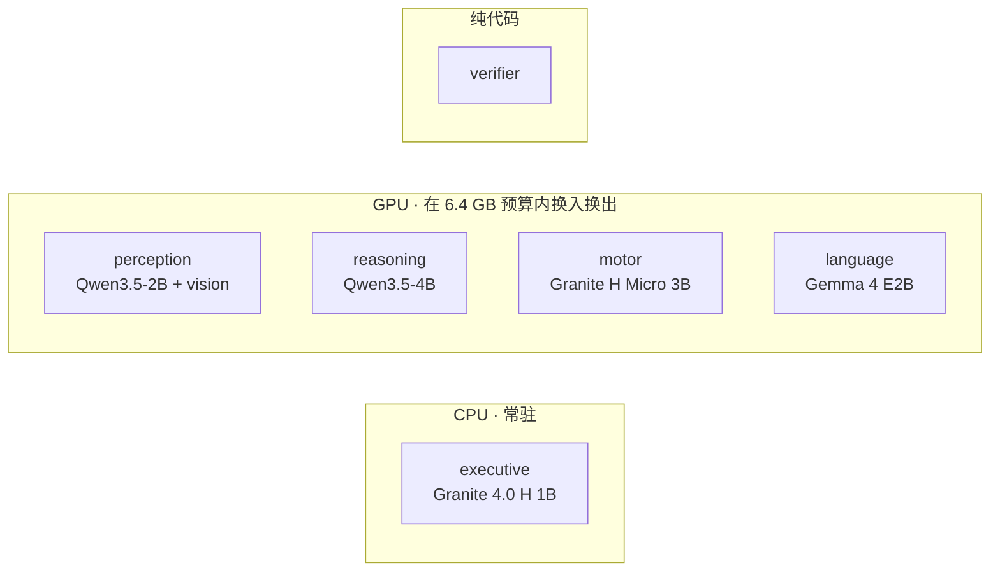
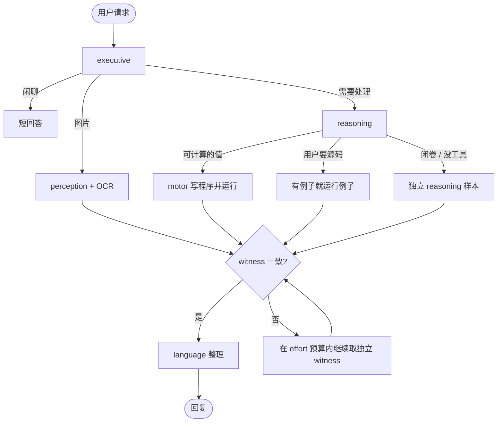

# Lobes

[English](README.md) | 中文

**Lobes 是一个实验性的本地 AI 运行时。它把一个助手拆成几个小模型，各自只做自己擅长的事，而不是每次都让一个更大的模型从头做到尾。**

我一开始想的问题很简单：如果把 AI 当成一家公司，是不是没必要每次都叫最贵的那个全能员工？数学题交给会算的，看图交给视觉模型，能用程序验证的就让程序再算一遍；只有几个“员工”意见不一致时，才继续花更多计算。

现在的版本由五个小模型和一个纯代码 verifier 组成。默认配置能在 RTX 4070 Laptop 的 8 GB 显存上运行：GPU 模型按需换入换出，executive 分类器常驻 CPU。

[评测](#评测结果) · [架构](#架构) · [怎么工作](#怎么工作) · [快速开始](#快速开始) · [结论](#结论)

## 预览

主要对照是一个不加任何框架的 Qwen3.5-9B。两边都能跑的 320 道文本题上，Lobes medium 连跑两遍，成绩都落在裸 9B 附近，但用的 token 和时间明显更少。

| | 裸 Qwen3.5-9B | Lobes medium |
|---|---:|---:|
| 正确 / 320 | 268 | 272、266 |
| token / 题 | 13,436 | **7,887** |
| 秒 / 题 | 62 | **34** |
| 图片输入 | 不支持 | **支持** |

也就是大约用了裸 9B **59% 的 token** 和 **55% 的时间**。两遍 Lobes 的成绩一个在 268 上面、一个在下面，所以我不把它写成“准确率超过 9B”。重复运行说明，分数会波动，但成本差距很稳定。

后来又加了 60 道更难、需要实际计算的题。Lobes medium 两遍是 55 和 56，裸 9B 是 31。不过这不是一个干净的“模型对模型”比较：Lobes 有 Python 工具，裸 9B 故意没有。所以我把它看成**整个运行时的结果**，而不是“小模型本身比 9B 更聪明”的证据。

---

## 为什么做这个项目

小模型便宜、快，但单个小模型很难什么都做好。大模型能力更全面，不过很多请求其实很简单，或者能被程序检查，用大模型从头跑到尾有点浪费。

Lobes 试的是中间路线：

- 先判断任务类型，再把请求交给对应的 specialist；
- 不让不同 witness 看到彼此的推导，尽量减少“抄同一个错答案”；
- 程序实际跑出来的值，比模型直接写出来的数字更可信；
- 只有 witness 不一致时才继续增加样本和计算；
- 模型只写在配置里，不把某一家模型硬编码进架构。

这是一个实验项目，不是要证明“模块化一定比大模型强”。所以仓库里也保留了失败的假设、重复跑出来的波动和后来删掉的设计。

## 架构

默认的 `specialists` profile 尽量让不同 lobe 做不同性质的工作，而不是只换几个 prompt。

| lobe | 实现 | 主要工作 |
|---|---|---|
| executive | Granite 4.0 H 1B，Q8，CPU 常驻 | 分类请求，判断是否值得跑程序 |
| perception | Qwen3.5-2B + vision projector | 看图、读图并给出视觉 witness |
| reasoning | Qwen3.5-4B | 推理、写实现、生成复算程序 |
| motor | Granite 4.0 H Micro 3B | 只根据原题写一个小程序，stdout 作为 witness |
| language | Gemma 4 E2B | 把已经定下来的值整理成人话，不改值 |
| verifier | 纯 Python | 跑题目自带例子、比较值、检查 OCR / 文本证据 |

具体模型都在 [`lobes.yaml`](lobes.yaml) 里。编排代码本身不写死模型名，所以可以换 roster 做对照实验。



更完整的设计在 [`docs/ARCHITECTURE.md`](docs/ARCHITECTURE.md)。

## 怎么工作

请求先到 executive。之后不会每次把所有模型都跑一遍，而是根据任务走不同路径。



最重要的一条是：witness 之间互相看不到对方的工作。它们只拿原始请求；图片题会另外拿到带来源的 perception / OCR 观察。两个 witness 对上就可以定值。如果有程序成功运行过，模型直接写的数字不能把程序输出投掉。没有可计算证据的题，则要求多次独立结果一致。

`--effort low|medium|high|xhigh|max|auto` 会一起调整思考预算、witness 数量、修复次数和单题上限。`auto` 从 medium 开始，只有当前预算用完还没定下来才继续升。

## 评测结果

下面的表都使用 seed 0；同一个对照里的题目完全相同；评测机上每次并行 4 道。裸 9B 是原样的 Qwen3.5-9B：每题一次模型调用，没有 Lobes 编排、没有 Python 工具，也不接图片。

medium 用同一份代码、同一台机器完整跑了两遍。两遍都放出来，不挑成绩高的那次。


| 题库 | 裸 9B | Lobes medium（两遍） | Lobes high | token / 题，9B | medium | high | 秒 / 题，9B | medium | high |
|---|---:|---:|---:|---:|---:|---:|---:|---:|---:|
| GSM8K，200 | 184 | 182、181 | 181 | 10,924 | 5,308 | 7,869 | 51 | 24 | 38 |
| HumanEval，30 | 29 | 29、27 | 28 | 15,786 | 6,516 | 8,532 | 76 | 28 | 46 |
| tools，30 | 25 | 30、30 | 30 | 15,176 | 8,134 | 19,867 | 72 | 35 | 95 |
| multistep，30 | 25 | 27、25 | 26 | 19,182 | 14,248 | 24,791 | 88 | 61 | 123 |
| SimpleQA，30 | 5 | 4、3 | 2 | 20,349 | 19,841 | 45,388 | 86 | 81 | 226 |
| OCRBench，50 | — | 36、37 | 36 | — | 11,109 | 15,857 | — | 54 | 70 |
| **双方共有的 320 道文本题** | **268** | **272、266** | **267** | **13,436** | **7,887** | **14,160** | **62** | **34** | **70** |

几个比总分更值得看的地方：

- **Tools 很稳定：** Lobes medium 两遍都是 30/30，裸 9B 是 25/30。
- **SimpleQA 还是很弱：** 这些本地小模型都不擅长闭卷事实问答。Lobes 更多是在学会“不确定就别硬猜”。
- **high 不划算：** 267/320 仍在两遍 medium 的波动范围里，但 token 多了大约 80%。
- **重复运行并不完全一致：** 370 道里有 11 道翻了判定。llama-server 四个并发 slot 的 batch 组成会影响浮点归约，即使 seed 相同也不保证生成完全一致。相比之下，两遍的 token 和时间只差约 1%。

### 更难的计算题

原来的 tools 已经跑到 30/30，继续用它很难看出差距，所以后来给 tools 和 multistep 各加了 30 道更难的题。老题没有改。新增题的期望值由 `eval/suites/make.py` 生成，不是手工把答案写进去。


| 每个题库新增 30 道 | 裸 9B | Lobes medium（两遍） | Lobes high | token / 题，9B | medium | high | 秒 / 题，9B | medium | high |
|---|---:|---:|---:|---:|---:|---:|---:|---:|---:|
| tools，更难 30 | 11 | 30、28 | 29 | 6,662 | 12,776 | 27,368 | 54 | 51 | 121 |
| multistep，更难 30 | 20 | 25、28 | 29 | 5,260 | 16,425 | 35,747 | 41 | 68 | 162 |
| **合计 60** | **31** | **55、56** | **58** | **5,961** | **14,601** | **31,558** | **48** | **60** | **141** |

这批题的取舍反过来了：Lobes 分数高很多，但 medium 在 60 道上用了裸 9B 大约 2.5 倍的 token，因为它要跑多个 witness 和程序。调用可以重叠，所以时间增长没有 token 那么夸张。

**注意：** 裸 9B 没有外部工具。因此 tools 的结果是在比较完整 Lobes runtime 和裸模型，而不是只比较模型本身的能力。更干净的消融实验应该给 9B 同样的 Python 权限；这组实验目前还没做。

完整的逐题分析、偏离记录、witness 统计和预注册假设都在 [`eval/REPORT.md`](eval/REPORT.md)。每一轮规则都在跑之前写下来：[`eval/PREREG.md`](eval/PREREG.md)、[`eval/PREREG-v3.md`](eval/PREREG-v3.md)、[`eval/PREREG-v4.md`](eval/PREREG-v4.md)。

## 结论

最后得到的结论其实比我刚开始做这个项目时想得窄一点。

在正常的 320 道文本题上，**Lobes 没有证明自己在准确率上明显超过单独的 9B**。两遍 medium 正好落在 9B 分数的两边。真正稳定的是效率：medium 少用了大约 41% 的 token、45% 的时间，同时成绩保持在同一个范围。

在需要计算的题上，模块化明显更有用，因为程序能抓到另一次语言模型采样很容易重复犯的错误。但这也会增加 token 成本，而且优势里有一部分就是“手里有 Python”。

对我来说比较有意思的一点是，这套系统后来变好，反而是因为删掉了一些“AI”。verifier 原来也是模型，现在大部分是确定性代码；executive 变成了一个常驻 CPU 的小分类器；high effort 看起来更强，但实际不值成本；几条预注册的想法也跑失败后被删掉了。

所以目前我愿意下的结论是：

> 多个小 specialist 在合适的路由、工具和验证下，可以成为“每次都跑一个更大模型”的实用替代方案。这个版本最稳定的收益是**计算效率和可验证性**，不是所有任务上的准确率胜利。

## 快速开始

要求：NVIDIA GPU，Python 3.11+。Windows 使用 llama.cpp 的 release binary；Linux 会从源码编译 `llama-server`，需要 `git`、`cmake` 和 `nvcc` 在 `PATH`。

```bash
pip install -e .
lobes install
lobes serve
```

另开一个终端：

```bash
lobes ask "what is 17 * 23"
lobes ask --image shot.png "what is on this screen"
lobes api
```

`lobes api` 会在 8090 端口提供 OpenAI 兼容的 `/v1/chat/completions`。`lobes models` 可以看当前模型状态。`pip install -e .[dev,eval]` 安装测试 / 评测依赖；`.[ocr]` 会加上 RapidOCR，作为第二个图片读取器。

> [!WARNING]
> Lobes 可以执行模型生成的 Python 和 shell 命令。现在的 runner **没有 sandbox**，Python 和 shell 会继承当前用户权限。对输入不放心时，请放进容器或一次性环境里运行。

文件工具限制在本次 run 的工作目录里，但 Python 和 shell 不受这个限制。工具执行有 10 秒超时。

## 复现实验

评测不是单独放在 notebook 里，harness 就在仓库中。benchmark 代码、预注册记录和报告都在 `eval/`。

```bash
pip install -e .[dev,eval]
pytest -q
lobes eval --help
```

GitHub Actions 会在每次 push 和 pull request 时运行单元测试，以及 tool、verifier、eval 模块自己的检查。

仓库没有把所有很大的逐题 trace 都直接提交进 git；需要时可以把完整 JSONL 结果放进 release artifacts。

## 项目状态

这个项目仍然在实验阶段。

目前在 RTX 4070 Laptop 8 GB 上验证过：

- 模型换入换出能保持在配置的 6.4 GB GPU 预算内；
- CPU classifier 常驻；
- 本地文本和图片请求可以正常工作；
- OpenAI 兼容 API 可以正常 round-trip；
- OCR 和 screenshot 路径可以到 perception；
- 测试会在 CI 中运行。

目前还没有做好的地方：

- 没有多轮记忆；
- 8 GB 换模型的配置一次只处理一个请求；
- 并发评测需要足够显存让需要的模型常驻；
- SimpleQA 这种事实回忆还是弱；
- Python / shell 没有 sandbox；
- 还缺一组“9B 也给同样 Python 工具”的消融实验。

## 仓库结构

- [`lobes/`](lobes/) — runtime、模型管理、API、工具和各个 lobe
- [`lobes.yaml`](lobes.yaml) — 模型 roster、provider、显存预算和 profile
- [`eval/`](eval/) — 题库、预注册、评测代码和报告
- [`docs/ARCHITECTURE.md`](docs/ARCHITECTURE.md) — 当前设计
- [`docs/DECISIONS.md`](docs/DECISIONS.md) — 按日期记录的工程决定和失败想法
- [`tests/`](tests/) — 单元测试

MIT License.