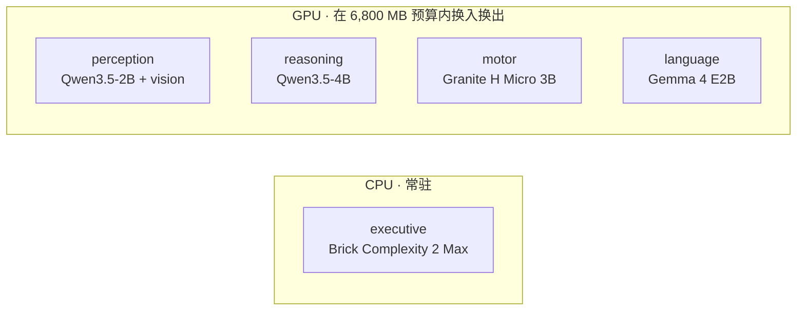
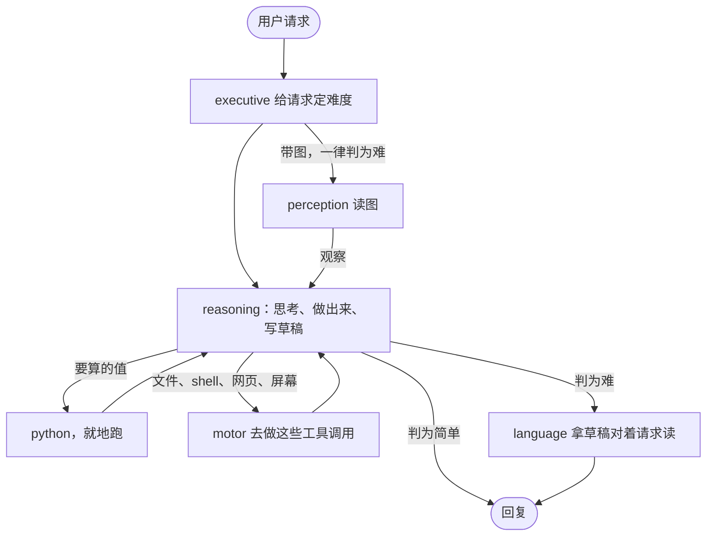

# Lobes

[English](README.md) | 中文

Lobes 是一个实验性的本地 AI 运行时。它把一个助手拆成几个小模型，每个只做自己擅长的事，取代每次都让一个更大的模型从头做到尾。

我一开始想的问题很简单：如果把 AI 当成一家公司，是不是没必要每次都叫最贵的那个全能员工？数学题交给会算的，看图交给视觉模型，算数交给程序。

现在的版本是五个小模型的一条接力，每个只有一份职责。默认配置能在 RTX 4070 Laptop 的 8 GB 显存上运行：GPU 模型按需换入换出，executive 分类器常驻 CPU。

[评测](#评测结果) · [架构](#架构) · [怎么工作](#怎么工作) · [快速开始](#快速开始) · [结论](#结论)

## 预览

Lobes 的求解叶就是 Qwen3.5-4B，所以真正该比的对照是同一个模型单独跑：一样的工具、一样的题号。这两列之间的差，就是另外四个 lobe 值多少。再放一个大约两倍大的裸 Qwen3.5-9B 当尺子。

| 每题库 100 道 | 裸 Qwen3.5-4B | Lobes medium | 裸 Qwen3.5-9B |
|---|---:|---:|---:|
| GSM8K | 66 | **71** | 69 |
| IFEval | 73 | **83** | 77 |
| MBPP+ | 66 | **79** | 77 |
| GPQA diamond | 67 | 69 | **71** |
| **合计 400 道** | 272 | **302** | 294 |

400 道逐题配对：自己的求解叶错、Lobes 对的有 60 道，反过来 30 道，净 30 道，McNemar p = 0.002。四个题库里有三个 Lobes 还更快。对裸 9B 是打平，43 比 35，p = 0.428：一条 4B 的接力和两倍大的模型打平。

四个题库涨得并不均匀。MBPP+ 最清楚：+13 道，p = 0.004；那里裸 4B 读进 1,037k 预填 token，Lobes 只有 562k，因为裸的那份把每一次工具结果都留在自己的对话里，下一轮再全部发一遍。GPQA 是平的那个：+2 道，p = 0.815。它考的是模型本来就记得的东西，每题只调约两次工具，没什么可以分给接力去扛。

四个题库各取 100 道，按等间隔穿过公开题集取号（文件里题目按类型扎堆，取前 100 会全是一类），seed 0，每一列题号相同，在一张 RTX 5090 上四路并发跑。那台机器的耗时不是单个用户的体感，4070 的数字在下面。

---

## 为什么做这个项目

小模型便宜、快，但单个小模型很难什么都做好。大模型能力更全面，不过很多请求其实很简单，或者能被程序检查，用大模型从头跑到尾有点浪费。

Lobes 试的是中间路线：

- 先判断任务类型，再把请求交给对应的 specialist；
- 让求解的那个模型去调程序，而不是在脑子里算；
- 程序实际跑出来的值，比模型直接写出来的数字更可信；
- 每个请求的 token、模型调用次数和时间都有上限，不会自动升档；
- 模型只写在配置里，不把某一家模型硬编码进架构。

这是一个实验项目，没打算证明“模块化一定比大模型强”。所以仓库里也保留了失败的假设、重复跑出来的波动和后来删掉的设计。

## 架构

默认的 `specialists` profile 里，每个 lobe 是不同的模型，做的也是不同性质的工作。

| lobe | 实现 | 主要工作 |
|---|---|---|
| executive | Brick Complexity 2 Max，Q8，CPU 常驻 | 给请求定难度；明确简单的跳过审查，其余都要走 |
| perception | Qwen3.5-2B + vision projector | 描述图片、抄出图里的文字 |
| reasoning | Qwen3.5-4B | 把请求想明白并写出回复；`python` 由它自己调 |
| motor | Granite 4.0 H Micro 3B | 工具手：执行 reasoning 要的调用，然后自己从结果里作答，结果留在它这儿 |
| language | Gemma 4 E2B | 拿写好的草稿对着请求读一遍，说哪里不对 |

具体模型都在 [`lobes.yaml`](lobes.yaml) 里。编排代码本身不写死模型名，所以可以换 roster 做对照实验。



更完整的设计在 [`docs/ARCHITECTURE.md`](docs/ARCHITECTURE.md)。

## 怎么工作

请求先到 executive，之后根据任务走不同路径，不会每次把所有模型都跑一遍。



每个 lobe 只被告知自己负责什么、交给谁，怎么做由它自己定。只有 reasoning 对用户说话；perception 把观察写进它的材料，motor 执行它用话提出的工具调用，language 读写好的草稿。language 打回时只记进 trace，草稿照样交出去；它以前会触发重写，三轮 250 道跑下来一道没救回、还弄坏两道。

回复写到一半撞上限的，会单独再要一次结论接到草稿后面；结论自己也写不完就丢掉，因为读的人会把最后一段当答案。整个请求耗尽预算、连草稿都还没有时，reasoning 会拿它已有的对话再答一次，把它读到和想到的东西交出来，而不是回一句“我没做完”。

`--effort low|medium|high` 决定单次调用的思考预算（1,024、4,096、8,192 token），以及单个请求的生成 token、模型调用次数和秒数上限。三档走的是同一条接力，不会自动升档；`auto`、`xhigh`、`max` 作为别名保留。秒数上限只拦新的调用，不打断正在加载的模型和正在跑的工具，所以一个请求可能超过这个时间。具体策略写在 [`docs/ARCHITECTURE.md`](docs/ARCHITECTURE.md)。

## 评测结果

每一列都用 seed 0、每个题库同样的 100 道题，在一张 RTX 5090 上四路并发跑。题号按等间隔穿过公开题集取（文件里题目按类型扎堆，取前 100 会全是一类）。两条裸臂都是原样的模型，拿着和 Lobes 一样的八个工具，身边没有别的 lobe。


| 题库 | 裸 4B | Lobes | 裸 9B |
|---|---:|---:|---:|
| GSM8K | 66 | **71** | 69 |
| IFEval | 73 | **83** | 77 |
| MBPP+ | 66 | **79** | 77 |
| GPQA diamond | 67 | 69 | **71** |
| **合计 400 道** | 272 | **302** | 294 |

每行最高的加粗。每题的秒数和 token 在上面第二张图里。

对自己的求解叶逐题配对，分题库看：MBPP+ +13（p = 0.004）、IFEval +10（p = 0.087）、GSM8K +5（p = 0.424）、GPQA +2（p = 0.815）。单独看只有 MBPP+ 过得了显著性，整个论据靠的是 400 道合在一起：60 道往一边、30 道往另一边，p = 0.002。

几点：

- MBPP+ 上这条分界线最好看。裸 4B 每题预填 10,370 token，接力只有 5,620：工具结果全留在裸的那份对话里，下一轮再发一遍。接力的工具手把结果留在自己那儿，交出去的是几句话。
- GPQA 是平的那个，它本来也该平。考的是模型已经记住的东西，每题只调约两次工具，没什么可以分出去。
- 裸 9B 在 MBPP+ 上每题只预填 900 token，裸 4B 是 10,370，因为它多半直接把答案写出来，不去碰工具。所以它在那里拿 77，裸 4B 只有 66。
- GSM8K、IFEval、MBPP+ 上 Lobes 比自己的求解叶快，GPQA 慢 3%。这张表里它比裸 9B 都慢；在 4070 上单请求跑，这个方向会反过来，见下。

### 在 RTX 4070 上

默认配置瞄的就是这张卡。下面全部是单请求不并发跑出来的，也就是一个人自己用时看到的样子。

**环境。** RTX 4070 Laptop，8 GB，显存预算 6,800 MB，单请求在飞。seed 0，题号和上面那张表完全一样的 400 道。

| 题库 | 裸 4B | Lobes | 裸 9B |
|---|---:|---:|---:|
| GSM8K | 73 | **79** | 74 |
| IFEval | 76 | **81** | 71 |
| MBPP+ | 69 | **81** | 78 |
| GPQA diamond | 64 | 71 | **74** |
| **合计 400 道** | 282 | **312** | 297 |

#### 每题秒数，中位

| 题库 | 裸 4B | Lobes | 裸 9B |
|---|---:|---:|---:|
| GSM8K | **9.7** | 13.8 | 13.6 |
| IFEval | **10.4** | 10.7 | 15.0 |
| MBPP+ | **10.6** | **10.6** | 11.0 |
| GPQA diamond | **75.4** | 77.7 | 119.8 |

#### 每题预填 token，中位

| 题库 | 裸 4B | Lobes | 裸 9B |
|---|---:|---:|---:|
| GSM8K | 2,040 | **1,542** | 2,016 |
| IFEval | 810 | 1,153 | **795** |
| MBPP+ | 3,574 | 2,186 | **824** |
| GPQA diamond | 8,242 | 5,604 | **4,708** |

每行最好的加粗；后两张表是越低越好。400 道逐题配对，裸 4B 错而接力对的有 60 道，反过来 30 道，p = 0.002，和 5090 上跑出来的是同一个比分。对裸 9B 是 47 比 32，p = 0.115。MBPP+ 的分数是拿存下来的答案离线重判的，因为跑的时候那个判分只读返回码，分不清测试没过和子进程根本没起来。

400 次请求里有 19 次需要换模型进出，累计花掉 65 秒，其余都是要用的模型已经在显存里。裸 9B 在这张卡上也装得下：实测 5,187 MB，预算 6,800 MB，全程常驻不换模。以上没有一条是显存论据。

## 结论

接力对得起它里面那个模型。5090 上 400 道逐题配对，裸 4B 错而它对的有 60 道，反过来 30 道，p = 0.002。4070 那轮换了硬件、改成单请求，跑出同一个比分：60 比 30，p = 0.002。这是这个仓库要论证的事，也是这里唯一一个对照组和它共用求解叶的结论。

它也压过了 9B。4070 上三条臂 400 道分别是 312、297、282，一个最大只有 4B 的接力排在一个两倍多大的模型前面。逐题配对是 47 比 32，p = 0.115：领先，但够不着显著。5090 上两边打平，302 对 294。

第二个模型值钱的地方是工具结果堆起来的时候。MBPP+ 会吐出一大堆，4070 上接力在那里拿 81 分，裸 4B 69 分，而且每题只读 2,186 个预填 token，裸 4B 要读 3,574，因为工具手把结果留在自己那儿，交出去的是几句话，不用把整段对话再发一遍。GPQA 是平的那个，它本来也该平：考的是模型已经记住的东西，每题只调约两次工具，没什么可以分出去。

4070 上单请求跑，典型一题接力 15.0 秒，裸 9B 16.8 秒，活儿越长差距越开：GPQA 上是 77.7 秒对 119.8 秒。裸 4B 自己跑更快，12.0 秒，这就是多出来那几只手的价钱。

对我来说最有用的结论还是：这套系统是在我把“AI”拿掉之后变好的。verifier 原来是个模型，现在整个删了；executive 变成常驻 CPU 的小分类器；审查模型打回后重写这件事，三轮跑下来一道没救回、还弄坏两道，重写也去掉了；几条预注册的想法跑失败后被删掉。

## 快速开始

要求：NVIDIA GPU，Python 3.11+。Windows 使用 llama.cpp 的 release binary；Linux 会从源码编译 `llama-server`，需要 `git`、`cmake` 和 `nvcc` 在 `PATH`。

```bash
pip install -e .
lobes install
lobes serve
```

另开一个终端：

```bash
lobes ask "what is 17 * 23"
lobes ask --image shot.png "what is on this screen"
lobes api
```

`lobes api` 会在 8090 端口提供 OpenAI 兼容的 `/v1/chat/completions`、`/v1/responses` 和 `/v1/models`。模型名决定用哪个 profile：`lobes/specialists` 是默认那条接力，`lobes-v1` 是更早那一版，路由模型把每个请求交给一个专家模型。思考过程按 `reasoning_content` 流式输出，请求里带了 `tools` 时，工具调用交回客户端去跑。`lobes models` 可以看当前模型状态。`pip install -e .[dev,eval]` 安装测试 / 评测依赖；`.[ocr]` 会加上 RapidOCR，作为第二个图片读取器。

> [!WARNING]
> Lobes 可以执行模型生成的 Python 和 shell 命令。runner **没有 sandbox**。用 root 启动时它会先降到 `nobody` 再跑，这挡得住它动你自己的文件；但 `nobody` 照样能上网，也能读任何 world-readable 的东西。用你自己的账号启动，它就有你全部的权限。对输入不放心时，请放进容器或一次性环境里运行。
>
> `lobes api` 没有任何鉴权。它监听 127.0.0.1，也应该一直留在那里：`--host 0.0.0.0` 等于把 python 和 shell 工具摆到所有能连上这个端口的人面前。

文件工具限制在本次 run 的工作目录里，但 Python 和 shell 不受这个限制。工具执行有 10 秒超时。

`lobes install` 会拿 `lobes.yaml` 里的 `sha256` 校验每个模型文件，对不上就删掉，所以 `HF_ENDPOINT` 指到镜像也不必信任那个镜像。

## 复现实验

benchmark 代码、预注册记录和报告都在 `eval/`。

```bash
pip install -e .[dev,eval]
pytest -q
lobes eval --help
```

GitHub Actions 会在每次 push 和 pull request 时运行单元测试，以及 tool、eval 模块自己的检查。

仓库没有把所有很大的逐题 trace 都直接提交进 git；需要时可以把完整 JSONL 结果放进 release artifacts。

## 项目状态

目前在 RTX 4070 Laptop 8 GB 上验证过：

- 模型换入换出能保持在配置的 6,800 MB GPU 预算内；
- CPU classifier 常驻；
- 本地文本和图片请求可以正常工作；
- OpenAI 兼容 API 可以正常 round-trip；
- OCR 和 screenshot 路径可以到 perception；
- 测试会在 CI 中运行。

目前还没有做好的地方：

- 没有多轮记忆；
- 8 GB 换模型的配置一次只处理一个请求；
- 并发评测需要足够显存让需要的模型常驻；
- SimpleQA 这种事实回忆还是弱；
- Python / shell 没有 sandbox；
- 生成的源码直接返回，没有运行或测试；
- 没有任何测试对着真的 llama-server 跑过，模型调用在测试里都是替身。

## 仓库结构

- [`lobes/`](lobes/)：runtime、模型管理、API、工具和各个 lobe
- [`lobes.yaml`](lobes.yaml)：模型 roster、provider、显存预算和 profile
- [`eval/`](eval/)：题库、预注册、评测代码和报告
- [`docs/ARCHITECTURE.md`](docs/ARCHITECTURE.md)：当前设计
- [`tests/`](tests/)：单元测试

## 详细上手步骤

上面的快速开始只有三行命令。这一节把每步拆开写，第一次装照着走就行。

### 装之前

需要一张 NVIDIA 显卡和 Python 3.11 以上。8 GB 显存能跑默认的 `specialists`，再小就得自己调 `lobes.yaml` 里的 `llama.vram_budget_mb` 和每个模型的 `vram_mb`。

Windows 上装的是 llama.cpp 的预编译包，不用装编译器。Linux 是从源码编 `llama-server`，`git`、`cmake`、`nvcc` 得在 `PATH` 里，缺一个第一步就会停。

### 装

```bash
pip install -e .
lobes install
```

`lobes install` 会下 llama.cpp 和当前 profile 用到的模型，然后写出 `models/models.ini`。模型加起来有好几个 G，第一次要等挺久；中间断了直接重跑，下好的不会再下一遍。

只装某个 profile 的模型：

```bash
lobes install --profile specialists
```

llama.cpp 已经自己放好了就加 `--skip-llama`。

### 起服务

```bash
lobes serve
```

这条会占住终端，别关。它起的是 llama.cpp 的 router，在 8080，本身不加载任何模型，等着按需装卸。每次 `lobes serve` 都会重写一遍 `models/models.ini`，所以改完 `lobes.yaml` 里的模型配置重启一下就生效。

### 问第一个问题

另开一个终端：

```bash
lobes ask "用 python 给我写一个贪吃蛇游戏"
```

第一次慢，因为要先把模型装进显存才能开始。模型还在显存里的时候，下一条马上就开始答。

看图：

```bash
lobes ask --image shot.png "这个屏幕上是什么"
```

让它想久一点：

```bash
lobes ask --effort high "把这个 CSV 按第三列排序，再算每组均值"
```

`--effort` 有 low、medium、high 三档，默认 medium。档位只决定每次调用能想多久和整个请求的上限，接力的形状不变。

看现在显存里装了什么：

```bash
lobes models
```

### 可选的几个包

```bash
pip install -e ".[ocr]"        # 多一个 RapidOCR 读图上的字
pip install -e ".[dev,eval]"   # 跑测试和评测要用
```

### 接 Codex

先把 API 起起来：

```bash
lobes api
```

它在 8090 开三个端点：`/v1/chat/completions`、`/v1/responses`、`/v1/models`。Codex 用的是 `/v1/responses`。

然后写 `~/.codex/config.toml`：

```toml
model = "lobes/specialists"
model_provider = "lobes"
model_reasoning_effort = "medium"

[model_providers.lobes]
name = "Lobes"
base_url = "http://127.0.0.1:8090/v1"
wire_api = "responses"
```

`base_url` 写到 `/v1` 就停，后面的 `/responses` 是 Codex 自己接上去的，写全了会 404。

`model` 填的是 profile，格式 `lobes/<profile>`。`lobes.yaml` 里现在有 `specialists`（默认）、`shared`、`v1`、`bare-9b`、`bare-4b`、`single-9b`、`single-4b`；另外 `lobes-v1` 是 `v1` 的别名。

`model_reasoning_effort` 会接到 Lobes 的档位上，`auto`、`xhigh`、`max` 分别当 medium、high、high。Codex 有时候发 `minimal`，Lobes 认不出来就用 `lobes.yaml` 里的默认值。

这里没写 `env_key`，因为 `api.py` 和 `responses.py` 里没有任何鉴权代码，key 不会被检查。客户端非要一个的话随便填。

Codex 自带工具的那些轮次，工具调用会发回 Codex 那边跑。

### 接 DeepSeek Harness

Harness 走 chat completions，同一个 8090 就够了。

在 `$DSH_HOME/settings.yaml` 里加：

```yaml
llm-pi-ai:
  providers:
    lobes:
      api: openai-completions
      baseURL: http://127.0.0.1:8090/v1
      models:
        - id: lobes/specialists
```

配好之后这个 provider 会出现在模型选择器里，选中一次就成为新会话的默认。

Harness 每轮会把工作区和策略快照当一条 user message 发过来。Lobes 认得它（`api.py` 里的 `CONTEXT` 常量），会把最新的一份并进 system prompt，不会当成新问题去解。

### 卡住了先看这几处

`lobes serve` 没起的话，`lobes ask` 会连不上 8080。

显存不够时模型管理器会直接报错，不会悄悄超预算。把 `vram_budget_mb` 调小，或者给某个模型加 `resident: true` 让它别被卸掉。

每次请求的完整过程写在 `runs/<task_id>/trace.jsonl`，一行一步，工具的原始输出另存成 json。答得不对的时候先翻这个文件。

## 许可

仓库里的代码是 MIT。

模型各有各的条款。默认 profile 里的 classifier `brick-2-max` 是 CC BY-NC 4.0，所以默认配置照原样不能商用；换掉那个槽在 `lobes.yaml` 里是一行的事。`v1` profile 里的 `nemotron-3-nano-4b` 用的是 NVIDIA open model license。其余六个都是 Apache 2.0。