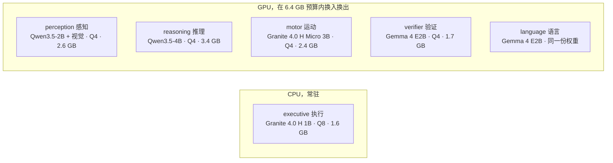
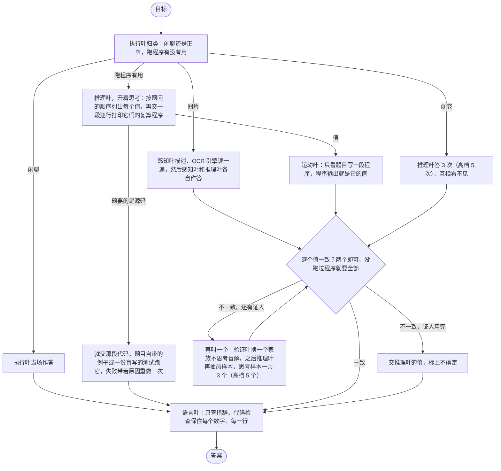

# Lobes

[English](README.md) | 中文

六个小模型跑在一张 8 GB 的笔记本显卡上，一个模型只管一件事。两个模型在互相看不见对方
的情况下得出同一个答案，这个答案才算数；程序打印出来的结果比模型写出来的文字更可信。
评测只问一个问题：这样拆开，比一个什么都不套的 9B 模型到底强在哪。

## 成绩

一张 RTX 5090，seed 0，每条线同一批题，每台机器 4 道题并行。裸 9B 是原样的
Qwen3.5-9B，每题一次调用，不给工具、不看图。第三版是这套运行时的 `specialists` 配置，
中档和高档各跑一遍。图里另有一条第二版：换上第三版归类的第二版，高档。

| 题库 | 裸 9B | 第三版中档 | 第三版高档 | 每题 token，9B | 中档 | 高档 | 每题秒，9B | 中档 | 高档 |
|---|---|---|---|---|---|---|---|---|---|
| GSM8K，200 道 | 184 | 177 | 182 | 10,924 | 6,557 | 8,176 | 51 | 27 | 37 |
| HumanEval，30 道 | 29 | 27 | 28 | 15,786 | 8,382 | 16,114 | 76 | 37 | 74 |
| tools，30 道 | 25 | 30 | 30 | 15,176 | 7,809 | 17,311 | 72 | 34 | 74 |
| multistep，30 道 | 25 | 25 | 25 | 19,182 | 16,659 | 26,408 | 88 | 70 | 121 |
| SimpleQA，30 道 | 5 | 2 | 2 | 20,349 | 19,237 | 38,989 | 86 | 79 | 177 |
| OCRBench，50 道 | 不看图 | 30 | 30 | | 8,925 | 12,909 | | 41 | 49 |
| 9B 跑的 320 道合计 | 268 | 261 | 267 | 13,436 | 8,981 | 14,375 | 62 | 38 | 65 |

拆开的初衷就是用 8 GB 笔记本显卡装得下的模型，花更少的 token 和时间给出同样的答案。
中档在 320 道上比 9B 少对七道，token 少 33%，时间少 39%；高档少对一道，token 多 7%，
时间多 4%。tools 是拆开赢得干脆的题库，两档都是 30/30 对 25/30。输在 GSM8K：高档错的
18 道里 11 道 9B 也错，其余多是两个证人同读错一处、一致错。SimpleQA 是弃答测试：9B 30
道全答、错 25 道；第三版弃答 22 道（高档 26），答错 5 道（高档 3）。逐题的分析、证人的
统计和预注册假设的核对（八条里六条不成立）都在 [eval/REPORT.md](eval/REPORT.md)；规则在
跑之前就写死在 [eval/PREREG.md](eval/PREREG.md) 和 [eval/PREREG-v3.md](eval/PREREG-v3.md)。

## 里程碑

2026-09-14 到 15 日，按先后。数字都在上面那张表的题上。

- **v1**，14 日上午。六个脑叶围着一块共享黑板：执行叶写计划，运动叶跑工具，推理叶作答，
  验证叶盲解一遍，语言叶组织措辞。在 4070 上做出来并跑完评测。tag `v1-4070`。
- **v2**，下午。对着 v1 的 trace 改，规则在 [eval/PREREG-v2.md](eval/PREREG-v2.md)。
  带着它原来的 1.2B 分类器，中档 234/320（tag `pre-v3`）。
- **v2 高档、换上 v3 的归类：241/320，tools 29/30 对裸 9B 的 25/30，第一个拆开比单个
  大模型更强的题库。** multistep 17/30 对 25/30，每题 20,000 token。分支 `v2-fix`。
- **v3**，晚上。黑板撤掉：每个证人只拿到题目，看不到任何别的证人产出的东西，两个一致
  就定案（[eval/PREREG-v3.md](eval/PREREG-v3.md)）。原来的 1.2B 执行叶 341 道分类题
  只对 157，换成 1B 的 Granite，对 330。
- **v3 中档：261 对裸 9B 的 268，token 只用了它的 67%，时间 61%；tools 30/30 对 25/30，
  multistep 25 对 25。** 15 日对着它的 trace 把契约改了五次（一行一值、跑过的程序不能
  被写出来的值压过、推理叶从第一个样本就思考），每一版的局部结果都留着，读在
  [eval/REPORT.md](eval/REPORT.md) 偏离 13 到 15。
- **v3 高档：267 对 268，token 是 9B 的 107%，时间 104%；GSM8K 182 对 184，HumanEval
  28 对 29，tools 30 对 25，multistep 25 对 25。** 拆开买到的是中档：三分之二的 token
  换来少七道的同样答案；买不到的是比 9B 自己更好的 GSM8K。

## 模型

能不伤成绩的地方一个脑叶一个家族。名单只在 `lobes.yaml` 里，代码里不出现任何模型名；
一个脑叶也可以是纯代码。全部在本机跑，什么都不往外发，题难也不会去叫更大的模型。
4070 上 GPU 里的模型在 6.4 GB 预算内换入换出，分类器留在 CPU，永远不参与换。

## 怎么干活

每个证人拿到的是题目（图片题另加感知叶和 OCR 各自读出的内容，标明来源），别的证人
产出的一概看不到。值的约定是一行一个、按题问的顺序，两个证人逐行都对上才算一致（先打印了
中间量的只比末尾）。两个一致就定案：有一个跑过程序叫 `evidence`，都没跑叫 `consistency`，但只要有程序跑过，
模型自己写的值一致不能压过它；闭卷题要连续三个样本一致。推理叶开着思考，运动叶和验证叶不思考：同一家族的两段不思考的程序会同读错一处题面、一致错，gsm8k 两百道里这样丢了十道。程序挂了只带着 stderr 修一次，仅此而已。`--effort low|medium|high|xhigh|max|auto` 一起调
思考长度、证人数量、修复次数和单题上限，表在 [docs/ARCHITECTURE.md](docs/ARCHITECTURE.md)。

## 快速开始

NVIDIA 显卡，Python 3.11+。Windows 直接下 llama.cpp 的发布版二进制；Linux 从源码编
llama-server（PATH 里要有 git、cmake、nvcc）。

    pip install -e .
    lobes install                   # llama.cpp + 默认配置要的 GGUF
    lobes serve                     # 一直开着
    lobes ask "what is 17 * 23"
    lobes ask --image shot.png "what is on this screen"
    lobes api                       # OpenAI 兼容的 /v1/chat/completions，端口 8090

`lobes models` 看当前装了什么。`pip install -e .[dev,eval]` 加上 pytest 和 `lobes eval`
要的题库读取器；`.[ocr]` 加第二个读图引擎。

## 状态

在 RTX 4070 Laptop（8 GB）上验证过：模型能装载、在语法约束下作答，换入换出不超预算，
api 能来回，截图能到 perception。没做：多轮记忆、任何并发。

设计笔记在 [docs/ARCHITECTURE.md](docs/ARCHITECTURE.md)，改了什么、为什么改在
[docs/DECISIONS.md](docs/DECISIONS.md)。MIT。
