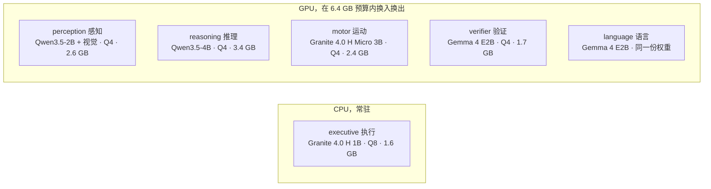
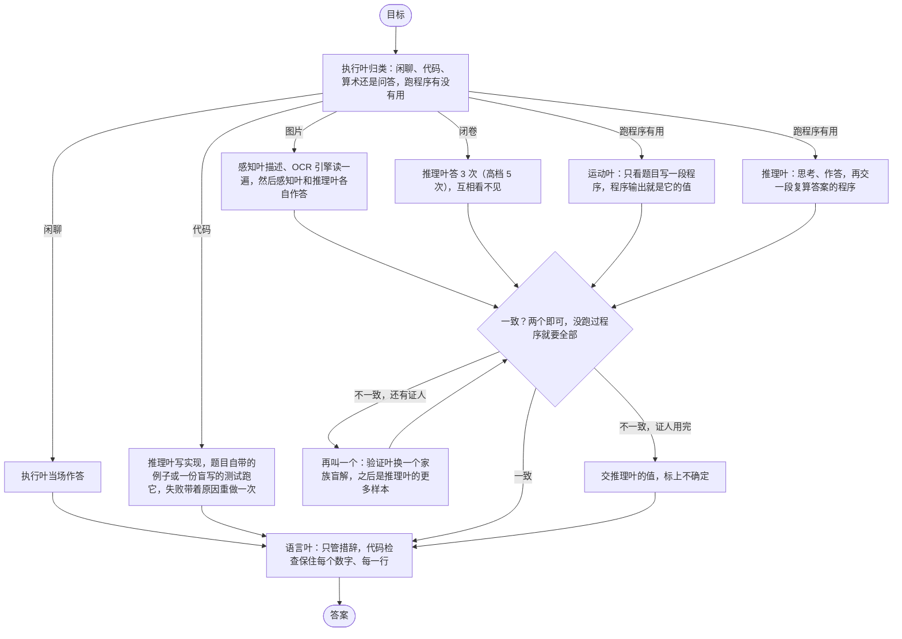

# Lobes

[English](README.md) | 中文

六个小模型跑在一张 8 GB 的笔记本显卡上，一个模型只管一件事。两个模型在互相看不见对方
的情况下得出同一个答案，这个答案才算数；程序打印出来的结果比模型写出来的文字更可信。
评测只问一个问题：这样拆开，比一个什么都不套的 9B 模型到底强在哪。

## 成绩

一张 RTX 5090，seed 0，每条线同一批题，每台机器 4 道题并行。裸 9B 是原样的
Qwen3.5-9B，每题一次调用，不给工具。第三版是这套运行时的 `specialists` 配置，中档。
题库跑完一个上一个：第三版的 SimpleQA、OCRBench、multistep，高档那一遍，和换上第三版
归类的第二版都还在跑。

| 题库 | 裸 9B | 第三版中档 | 每题 token，9B | token，第三版 | 每题秒，9B | 秒，第三版 |
|---|---|---|---|---|---|---|
| GSM8K，200 道 | 184 | 181 | 10,924 | 6,805 | 51 | 31 |
| HumanEval，30 道 | 29 | 28 | 15,786 | 6,893 | 76 | 32 |
| tools，30 道 | 25 | 27 | 15,176 | 8,572 | 72 | 36 |
| 三个合计，260 道 | 238 | 236 | 11,976 | 7,019 | 56 | 31 |

拆开的初衷就是用 8 GB 笔记本显卡装得下的模型，花更少的 token 和时间给出同样的答案。
先跑完的三个题库上，260 道少对两道，token 少 41%，时间少 44%，tools 反而多对。GSM8K
错的 19 道里 12 道 9B 也错。逐题的分析、证人的统计和预注册假设的核对都在
[eval/REPORT.md](eval/REPORT.md)；规则在跑之前就写死在
[eval/PREREG.md](eval/PREREG.md) 和 [eval/PREREG-v3.md](eval/PREREG-v3.md)。

## 里程碑

全部在 2026-09-14 这一天，按先后。前三个在第一套题量上、一次一道题；v3 在放大后的题
库上，两把尺子之间不能互比。

- **v1**，上午。六个脑叶围着一块共享黑板：执行叶写计划，运动叶跑工具，推理叶作答，
  验证叶盲解一遍，语言叶组织措辞。在 4070 上做出来并跑完评测；搬到 5090 上，9B 跑的
  四个题库合计 74/90。tag `v1-4070`。
- **v2**，下午。对着 v1 的 trace 改，规则在 [eval/PREREG-v2.md](eval/PREREG-v2.md)。
  中档 78/90。
- **v2 高档：82/90 对裸 9B 的 84/90，token 只用了它的 60%，时间只用了 73%。** tools
  20/20 对 18/20，第一个拆开比单个大模型更强的题库。HumanEval 26 对 27，GSM8K 27 对
  29，multistep 9 对 10。
- **v3**，晚上。黑板撤掉：每个证人只拿到题目，看不到任何别的证人产出的东西，两个一致
  就定案（[eval/PREREG-v3.md](eval/PREREG-v3.md)）。原来的 1.2B 执行叶 341 道分类题
  只对 157，换成 1B 的 Granite，对 330。
- **v3 中档在放大后的题库上，先跑完的三个题库：236 对裸 9B 的 238，token 只用了它的
  59%，时间 56%，tools 27/30 对 25/30。** 剩下的题库和高档还在跑。

第二版在第一套题量上的成绩，留个底：

| 题库 | 裸 9B | 第二版中档 | 第二版高档 |
|---|---|---|---|
| GSM8K | 29/30 | 27/30 | 27/30 |
| HumanEval | 27/30 | 24/30 | 26/30 |
| tools | 18/20 | 18/20 | 20/20 |
| multistep | 10/10 | 9/10 | 9/10 |
| SimpleQA | 2/30 | 3/30 | 2/30 |
| OCRBench | 不看图 | 12/20 | 12/20 |
| 9B 跑的那四个题库合计 | 84/90 | 78/90 | 82/90 |
| 那四个题库每题 token | 12,279 | 3,763 | 7,426 |
| 那四个题库每题秒数 | 32 | 11 | 24 |

## 模型

能不伤成绩的地方一个脑叶一个家族。名单只在 `lobes.yaml` 里，代码里不出现任何模型名；
一个脑叶也可以是纯代码。全部在本机跑，什么都不往外发，题难也不会去叫更大的模型。
4070 上 GPU 里的模型在 6.4 GB 预算内换入换出，分类器留在 CPU，永远不参与换。

## 怎么干活

每个证人拿到的是题目（图片题另加感知叶和 OCR 各自读出的内容，标明来源），别的证人
产出的一概看不到。两个一致就定案：有一个跑过程序叫 `evidence`，都没跑叫 `consistency`；
闭卷题要所有样本一致。程序挂了只带着 stderr 修一次，仅此而已。`--effort low|medium|high|xhigh|max|auto` 一起调
思考长度、证人数量、修复次数和单题上限，表在 [docs/ARCHITECTURE.md](docs/ARCHITECTURE.md)。

## 快速开始

NVIDIA 显卡，Python 3.11+。Windows 直接下 llama.cpp 的发布版二进制；Linux 从源码编
llama-server（PATH 里要有 git、cmake、nvcc）。

    pip install -e .
    lobes install                   # llama.cpp + 默认配置要的 GGUF
    lobes serve                     # 一直开着
    lobes ask "what is 17 * 23"
    lobes ask --image shot.png "what is on this screen"
    lobes api                       # OpenAI 兼容的 /v1/chat/completions，端口 8090

`lobes models` 看当前装了什么。`pip install -e .[dev,eval]` 加上 pytest 和 `lobes eval`
要的题库读取器；`.[ocr]` 加第二个读图引擎。

## 状态

在 RTX 4070 Laptop（8 GB）上验证过：模型能装载、在语法约束下作答，换入换出不超预算，
api 能来回，截图能到 perception。没做：多轮记忆、任何并发。

设计笔记在 [docs/ARCHITECTURE.md](docs/ARCHITECTURE.md)，改了什么、为什么改在
[docs/DECISIONS.md](docs/DECISIONS.md)。MIT。
